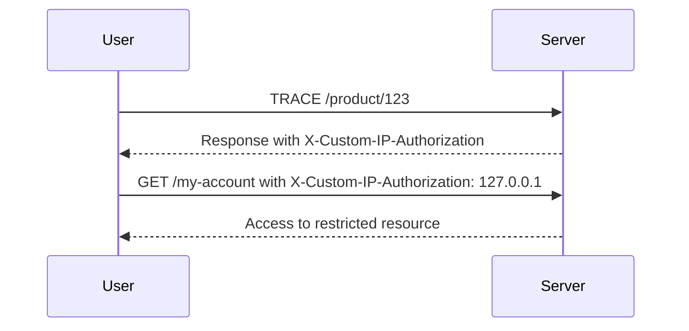

## Information Disclosure and Authentication Bypass

### Introduction to Information Disclosure

Information disclosure vulnerabilities occur when an application unintentionally reveals sensitive data to unauthorized users. This can happen through various means, such as improper error handling, verbose logging, or misconfigured HTTP methods. In the context of web applications, information disclosure can lead to significant security risks, including authentication bypasses, data leaks, and more.

### Understanding HTTP Methods

HTTP methods are verbs that indicate the desired action to be performed on a resource. Common methods include `GET`, `POST`, `PUT`, `DELETE`, and `TRACE`. Each method serves a specific purpose:

- **`GET`**: Requests a representation of the specified resource. Typically used to retrieve data.
- **`POST`**: Submits an entity to the specified resource, often causing a change in state or side effects on the server.
- **`PUT`**: Updates or replaces the entire contents of the resource identified by the URI.
- **`DELETE`**: Deletes the specified resource.
- **`TRACE`**: Echoes back the received request so that a client can see what (if any) changes or additions have been made by intermediate servers.

#### Example of HTTP Methods

Consider the following HTTP request:

```http
GET /product/123 HTTP/1.1
Host: www.example.com
```

This request uses the `GET` method to fetch the details of a product with ID `123`.

### The `TRACE` Method and Its Risks

The `TRACE` method is primarily used for diagnostic purposes. It echoes back the received request to the client, allowing developers to inspect the request and understand how it is being processed by intermediate servers. However, this method can pose significant security risks if enabled in a production environment.

#### Why `TRACE` Should Not Be Enabled in Production

Enabling the `TRACE` method in a production environment can lead to the leakage of sensitive information, such as headers containing authentication tokens or other confidential data. This can be exploited by attackers to gain unauthorized access to resources.

### Case Study: Exploiting `TRACE` for Authentication Bypass

In the provided scenario, the application is using the `TRACE` method to reveal sensitive information, specifically a custom header named `X-Custom-IP-Authorization`. This header contains the IP address of the user, which the application trusts if it matches `127.0.0.1` (localhost).

#### Step-by-Step Exploitation

1. **Identify the Vulnerability**:
    - Send a `TRACE` request to the server.
    - Observe the response to identify any sensitive headers.

2. **Exploit the Vulnerability**:
    - Craft a new request with the `X-Custom-IP-Authorization` header set to `127.0.0.1`.
    - Send the request using the `GET` method to attempt accessing restricted resources.

#### Example Code

Here is an example of how to craft and send the `TRACE` and `GET` requests using Python's `requests` library:

```python
import requests

# Step 1: Send TRACE request
trace_url = "http://www.example.com/product/123"
headers = {
    "Method": "TRACE",
    "Host": "www.example.com",
    "X-Custom-IP-Authorization": "127.0.0.1"
}

response_trace = requests.request("TRACE", trace_url, headers=headers)
print(response_trace.text)

# Step 2: Send GET request with crafted header
get_url = "http://www.example.com/my-account"
headers_get = {
    "X-Custom-IP-Authorization": "127.0.0.1"
}

response_get = requests.get(get_url, headers=headers_get)
print(response_get.text)
```

### Diagramming the Attack Chain

A mermaid diagram can help visualize the attack chain:



### Real-World Examples and Recent Breaches

Several real-world examples highlight the dangers of information disclosure:

- **CVE-2021-21972**: A vulnerability in Apache Tomcat allowed attackers to read arbitrary files due to improper handling of the `TRACE` method.
- **CVE-2022-22965**: A flaw in Microsoft Exchange Server exposed sensitive information through the `TRACE` method, leading to unauthorized access.

### How to Prevent / Defend Against Information Disclosure

#### Detection

To detect information disclosure vulnerabilities, perform regular security assessments and penetration testing. Tools like Burp Suite, ZAP, and OWASP Dependency-Check can help identify such issues.

#### Prevention

1. **Disable Unnecessary HTTP Methods**:
    - Ensure that methods like `TRACE` are disabled in production environments.
    - Configure your web server to reject these methods.

2. **Secure Headers**:
    - Implement proper header validation and sanitization.
    - Avoid exposing sensitive information through custom headers.

3. **Secure Coding Practices**:
    - Use secure coding guidelines to prevent accidental exposure of sensitive data.
    - Validate and sanitize all inputs and outputs.

#### Secure Code Fix

Compare the vulnerable and secure versions of the code:

**Vulnerable Code**:

```python
def handle_request(request):
    if request.method == "TRACE":
        return request.headers
```

**Secure Code**:

```python
def handle_request(request):
    if request.method == "TRACE":
        return "Method not allowed", 405
```

### Hands-On Labs

For practical experience, consider the following labs:

- **PortSwigger Web Security Academy**: Offers detailed labs on information disclosure and authentication bypass.
- **OWASP Juice Shop**: Provides a vulnerable web application for practicing various security techniques.
- **DVWA (Damn Vulnerable Web Application)**: A deliberately insecure web application for security testing.

### Conclusion

Understanding and preventing information disclosure vulnerabilities is crucial for maintaining the security of web applications. By disabling unnecessary HTTP methods, securing headers, and implementing secure coding practices, organizations can significantly reduce the risk of such vulnerabilities. Regular security assessments and hands-on practice are essential for mastering these concepts.

---
<!-- nav -->
[[06-Information Disclosure Vulnerability|Information Disclosure Vulnerability]] | [[Web Security (PortSwigger)/17-Information Disclosure/05-Lab 4 Authentication bypass via information disclosure/00-Overview|Overview]] | [[08-Understanding the Lab Setup|Understanding the Lab Setup]]
