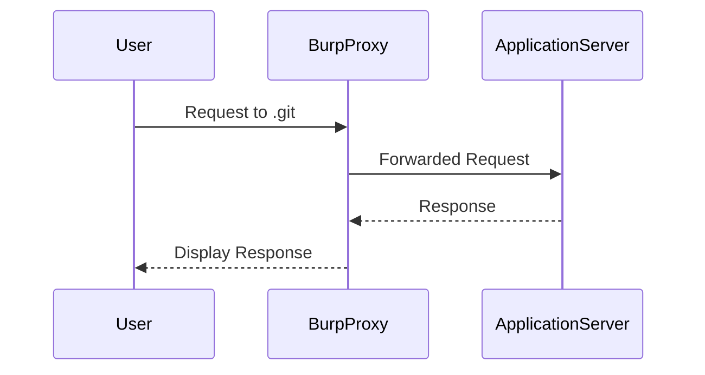

## Introduction to Information Disclosure in Version Control History

Information disclosure is a type of vulnerability that occurs when sensitive data is inadvertently exposed to unauthorized users. One specific form of this vulnerability is information disclosure through version control history. Version control systems like Git, SVN, and Mercurial are essential tools for managing changes to codebases, but they can also become a source of security risks if not properly managed.

### What is Version Control?

Version control systems allow developers to track changes to their codebase over time. Each change, or commit, is recorded along with metadata such as the author, date, and a description of the changes made. This allows developers to revert to previous versions of the codebase if necessary, and it provides a detailed history of how the project has evolved.

#### Why Version Control Matters

Version control is crucial for several reasons:

- **Collaboration**: Multiple developers can work on the same codebase simultaneously without conflicts.
- **Backup**: Every commit is a backup of the codebase at that point in time.
- **History**: Developers can review past changes to understand why certain decisions were made.
- **Branching and Merging**: Different features or bug fixes can be developed in parallel and merged back into the main codebase.

### Information Disclosure Vulnerability

Information disclosure occurs when sensitive information is unintentionally exposed to unauthorized users. In the context of version control, this can happen if sensitive data is committed to the repository and later accessed by unauthorized individuals.

#### Real-World Examples

Several high-profile incidents have highlighted the risks of information disclosure through version control:

- **CVE-2021-22205**: A vulnerability was discovered in the GitLab CI/CD pipeline where sensitive environment variables were exposed in the build logs.
- **GitHub Data Breach (2020)**: GitHub experienced a data breach where sensitive information, including private repositories, was exposed due to misconfigured access controls.

### Lab Setup

To understand and mitigate this vulnerability, we will walk through a practical lab scenario using the Web Security Academy. The lab is titled "Information Disclosure in Version Control History."

#### Accessing the Lab

1. **Sign Up**: Visit `https://portswigger.net/web-security` and sign up for an account.
2. **Navigate to Labs**: Once logged in, navigate to the "Academy" section and select "All Labs."
3. **Search for Lab**: Search for "information disclosure" and find the lab titled "Information Disclosure in Version Control History."

### Goal of the Lab

The primary objective of this lab is to demonstrate how sensitive information can be disclosed through version control history. Specifically, we need to:

1. Obtain the password for the administrator user.
2. Log in as the administrator.
3. Delete Carlos' account.

### Accessing the Lab Environment

Once you have accessed the lab, you will notice that the built-in browser in Burp Suite is being used to interact with the application. This means all your requests are being intercepted by Burp Proxy, allowing you to analyze and manipulate them.

### Identifying Endpoints

To begin our investigation, we need to identify endpoints that might contain version control history. One common endpoint to check is `.git`.



### Checking for `.git` Endpoint

Let's start by checking if the `.git` endpoint exists.

```http
GET /path/to/.git HTTP/1.1
Host: target.example.com
```

If the endpoint exists, the server will respond with the contents of the `.git` directory. This directory contains various files and subdirectories that make up the Git repository.

### Analyzing the `.git` Directory

The `.git` directory contains several important files and directories:

- **HEAD**: Points to the current branch.
- **config**: Configuration settings for the repository.
- **description**: A short description of the repository.
- **hooks/**: Scripts that run automatically when certain events occur.
- **info/**: Additional information about the repository.
- **objects/**: Contains the actual content of the commits.
- **refs/**: References to branches and tags.

#### Example Response

```http
HTTP/1.1 200 OK
Date: Mon, 20 Mar 2023 12:00:00 GMT
Server: Apache/2.4.41 (Ubuntu)
Content-Type: text/html; charset=UTF-8
Content-Length: 1234

<!DOCTYPE html>
<html>
<head>
<title>.git Directory</title>
</head>
<body>
<h1>.git Directory</h1>
<ul>
<li><a href="HEAD">HEAD</a></li>
<li><a href="config">config</a></li>
<li><a href="description">description</a></li>
<li><a href="hooks/">hooks/</a></li>
<li><a href="info/">info/</a></li>
<li><a href="objects/">objects/</a></li>
<li><a href="refs/">refs/</a></li>
</ul>
</body>
</html>
```

### Extracting Sensitive Information

Once we have access to the `.git` directory, we can extract sensitive information such as passwords, API keys, and other confidential data. This is often done by examining the commit history and looking for files that contain sensitive data.

#### Example Commit History

```http
GET /path/to/.git/logs/HEAD HTTP/1.1
Host: target.example.com
```

This request retrieves the commit history, which can be analyzed to find sensitive information.

### Obtaining the Administrator Password

In this lab, we need to find the password for the administrator user. This can be done by examining the commit history and looking for files that contain the password.

#### Example Password File

```plaintext
# Example password file
admin_password = "supersecretpassword"
```

### Logging in as the Administrator

Once we have obtained the administrator password, we can log in to the application and perform administrative actions, such as deleting Carlos' account.

#### Example Login Request

```http
POST /login HTTP/1.1
Host: target.example.com
Content-Type: application/x-www-form-urlencoded

username=admin&password=supersecretpassword
```

### Deleting Carlos' Account

After logging in as the administrator, we can delete Carlos' account by sending a request to the appropriate endpoint.

#### Example Delete Request

```http
DELETE /users/carlos HTTP/1.1
Host: target.example.com
Authorization: Bearer <admin_token>
```

### How to Prevent / Defend Against Information Disclosure

To prevent information disclosure through version control history, several best practices should be followed:

1. **Secure Repository Access**: Ensure that only authorized users have access to the repository. Use strong authentication mechanisms and limit access based on roles.
2. **Sensitive Data Management**: Avoid committing sensitive data such as passwords, API keys, and private keys to the repository. Use environment variables or external secrets management tools instead.
3. **Regular Audits**: Regularly audit the repository to ensure that no sensitive data has been accidentally committed. Use tools like `git-secrets` to scan for sensitive data.
4. **Secure Configuration Files**: Ensure that configuration files do not contain sensitive data. Use placeholders or environment variables to store sensitive information.
5. **Educate Developers**: Educate developers about the risks of committing sensitive data and the importance of securing the repository.

#### Secure Coding Practices

Here is an example of how to securely manage sensitive data:

**Vulnerable Code**

```python
# Vulnerable code
import os

api_key = "supersecretauthtoken"
os.environ["API_KEY"] = api_key
```

**Secure Code**

```python
# Secure code
import os

api_key = os.getenv("API_KEY")
if not api_key:
    raise ValueError("API_KEY environment variable not set")
```

### Conclusion

Information disclosure through version control history is a serious security risk that can lead to significant consequences. By following best practices and using secure coding techniques, organizations can mitigate these risks and protect their sensitive data.

### Practice Labs

For hands-on practice, consider the following labs:

- **PortSwigger Web Security Academy**: Offers a variety of labs related to information disclosure and version control history.
- **OWASP Juice Shop**: Provides a vulnerable web application for practicing various security concepts, including information disclosure.
- **DVWA (Damn Vulnerable Web Application)**: Another popular web application for practicing web security skills.

By completing these labs, you can gain practical experience in identifying and mitigating information disclosure vulnerabilities.

---
<!-- nav -->
[[Web Security (PortSwigger)/17-Information Disclosure/06-Lab 5 Information disclosure in version control history/00-Overview|Overview]] | [[02-Information Disclosure in Version Control History|Information Disclosure in Version Control History]]
