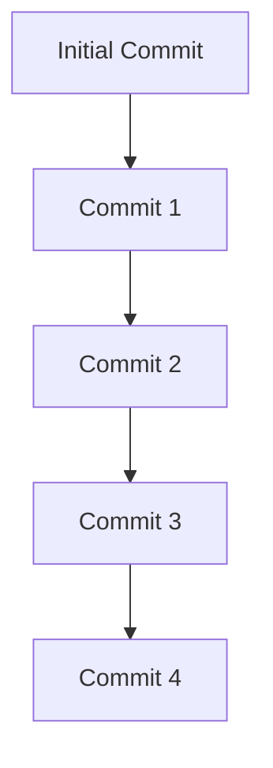

## Information Disclosure in Version Control History

### Introduction to Information Disclosure

Information disclosure vulnerabilities occur when sensitive information is unintentionally exposed to unauthorized users. This can happen through various means, including version control systems such as Git. In this section, we will explore how sensitive data can be inadvertently stored in version control history and how attackers can exploit this to gain unauthorized access.

### Background Theory

Version control systems like Git are essential tools for managing changes to software projects. They allow developers to track modifications, collaborate effectively, and revert to previous states if necessary. However, these systems also store a complete history of all changes made to the project, which can include sensitive information such as passwords, API keys, and other confidential data.

#### How Version Control Systems Work

Git operates by maintaining a repository of all changes made to a project. Each change is recorded as a commit, which includes metadata such as the author, timestamp, and a description of the changes. These commits form a linear history, allowing developers to trace the evolution of the project over time.



### Real-World Examples

Several high-profile breaches have occurred due to information disclosure in version control history:

- **CVE-2020-13777**: A vulnerability in the GitLab CI/CD pipeline allowed attackers to access sensitive environment variables stored in the pipeline configuration.
- **GitHub Data Breach (2020)**: An attacker gained unauthorized access to private repositories, exposing sensitive data stored in version control history.

These incidents highlight the importance of securing version control systems and ensuring that sensitive information is not inadvertently stored in the repository history.

### Detailed Walkthrough

Let's walk through the process described in the lecture transcript to understand how sensitive information can be disclosed in version control history.

#### Step-by-Step Process

1. **Identify the Vulnerable Commit**:
   - Navigate to the version control system (e.g., GitHub) and inspect the commit history.
   - Look for commits that may contain sensitive information, such as passwords or API keys.

2. **Clone the Repository**:
   - Copy the URL of the repository.
   - Open a new terminal and navigate to the desired directory.
   - Clone the repository using `git clone` or `wget` commands.

   ```bash
   wget -r <repository-url>
   ```

3. **Inspect the Repository**:
   - Use a Git client (e.g., Git Cola) to inspect the commit history.
   - Identify the commit that contains the sensitive information.

4. **Revert the Commit**:
   - Use Git commands to revert the commit and inspect the contents.

   ```bash
   git checkout <commit-hash>
   cat <file-containing-sensitive-data>
   ```

5. **Exploit the Information**:
   - Use the extracted sensitive information (e.g., admin password) to gain unauthorized access to the application.

### Pitfalls and Common Mistakes

- **Committing Sensitive Data**: Developers often inadvertently commit sensitive data to version control systems. This can occur due to carelessness or lack of awareness about the risks.
- **Incomplete Removal**: Simply removing sensitive data from a commit does not remove it from the version control history. The data remains accessible through the commit history.
- **Insufficient Access Controls**: Weak access controls on version control systems can allow unauthorized users to access sensitive information.

### How to Prevent / Defend

#### Detection

- **Static Analysis Tools**: Use static analysis tools to scan version control repositories for sensitive data. Tools like `git-secrets` can help identify and flag sensitive information in commits.

  ```bash
  git secrets --register-aws
  git secrets --scan
  ```

- **Continuous Monitoring**: Implement continuous monitoring to detect unauthorized access attempts to version control systems.

#### Prevention

- **Secure Coding Practices**: Train developers to avoid committing sensitive data to version control systems. Use `.gitignore` files to exclude sensitive files from being tracked.
- **Use Environment Variables**: Store sensitive data in environment variables rather than hardcoding them in source code.
- **Regular Audits**: Conduct regular audits of version control repositories to ensure that sensitive data is not present.

#### Secure Code Fix

##### Vulnerable Code Example

```yaml
# .env
ADMIN_PASSWORD=supersecretpassword
```

##### Secure Code Example

```yaml
# .env
ADMIN_PASSWORD=${ADMIN_PASSWORD}
```

In the secure version, the password is stored in an environment variable, which is not committed to the version control system.

### Complete Example

#### Full HTTP Request and Response

Consider a scenario where an attacker gains access to a version control repository and extracts sensitive information. The following example demonstrates the HTTP request and response for accessing the repository and extracting the sensitive data.

```http
GET /repos/username/repository-name/commits HTTP/1.1
Host: api.github.com
Authorization: token <access-token>

HTTP/1.1 200 OK
Content-Type: application/json
{
  "sha": "0A17",
  "commit": {
    "author": {
      "name": "Carlos",
      "email": "carlos@example.com",
      "date": "2023-01-01T12:00:00Z"
    },
    "message": "Removed admin password from config"
  }
}
```

#### Full Policy/Config File

The following example shows a Git configuration file that ensures sensitive data is not committed to the repository.

```ini
[user]
    name = John Doe
    email = john.doe@example.com

[core]
    excludesfile = ~/.gitignore_global
```

#### Expected Result/Output

The expected result is that the sensitive data is not present in the version control history, and unauthorized access attempts are detected and prevented.

### Practice Labs

For hands-on practice, consider the following labs:

- **PortSwigger Web Security Academy**: Offers exercises on detecting and preventing information disclosure vulnerabilities.
- **OWASP Juice Shop**: Provides a vulnerable web application for practicing security testing and exploitation techniques.
- **DVWA (Damn Vulnerable Web Application)**: A deliberately insecure web application for security training purposes.

By following these steps and best practices, you can effectively prevent information disclosure vulnerabilities in version control systems and ensure the security of your software projects.

---
<!-- nav -->
[[01-Introduction to Information Disclosure in Version Control History|Introduction to Information Disclosure in Version Control History]] | [[Web Security (PortSwigger)/17-Information Disclosure/06-Lab 5 Information disclosure in version control history/00-Overview|Overview]] | [[Web Security (PortSwigger)/17-Information Disclosure/06-Lab 5 Information disclosure in version control history/03-Practice Questions & Answers|Practice Questions & Answers]]
