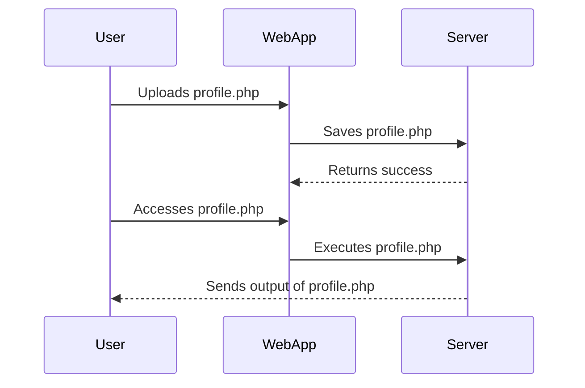

## What is a File Upload Vulnerability?

A file upload vulnerability occurs when a web application allows users to upload files to the server without proper validation or sanitization. This can lead to various security risks, including remote code execution, denial of service, and data leakage. Essentially, if a user can upload a file that the server will execute or serve in a way that was not intended, the application is vulnerable.

### Why Does This Matter?

File upload vulnerabilities are significant because they can be exploited to bypass other security measures. For instance, an attacker might upload a malicious script that, when executed, could gain unauthorized access to sensitive information or take control of the server. These vulnerabilities are often overlooked during development and testing phases, making them a common target for attackers.

### How Does It Work Under the Hood?

When a user uploads a file through a web interface, the server receives the file and typically stores it in a designated directory. If the server does not validate the file type, size, or content, an attacker can upload a file that contains malicious code. For example, an attacker might upload a PHP script that, when accessed via a URL, executes arbitrary commands on the server.

#### Example Scenario

Consider a web application that allows users to upload profile pictures. If the application does not properly validate the uploaded files, an attacker could upload a file named `profile.php` instead of a `.jpg` image. If the server saves this file and allows it to be executed, the attacker could potentially run arbitrary PHP code on the server.



### Real-World Examples

One notable real-world example is the CVE-2018-1337, also known as "CloudBleed." This vulnerability affected Cloudflare's CDN services, allowing attackers to upload malicious JavaScript files that were then served to unsuspecting users. This led to potential data leakage and cross-site scripting (XSS) attacks.

Another example is the CVE-2019-11510, which affected WordPress plugins that allowed file uploads. Attackers could upload PHP scripts that would be executed by the server, leading to remote code execution.

### Common Mistakes

Developers often make several common mistakes that lead to file upload vulnerabilities:

1. **Insufficient Validation**: Not checking the file type, size, or content.
2. **Improper Sanitization**: Not cleaning the file name or content to remove malicious characters.
3. **Incorrect Permissions**: Setting incorrect permissions on uploaded files, allowing them to be executed.
4. **Lack of Content-Type Checking**: Relying solely on file extensions rather than MIME types.

### How to Find File Upload Vulnerabilities

Finding file upload vulnerabilities can be approached from both a white-box and a black-box perspective.

#### White-Box Testing

In white-box testing, you have access to the application source code. You can review the code to identify areas where file uploads are handled and check for proper validation and sanitization.

##### Example Code Review

Consider the following PHP code snippet that handles file uploads:

```php
<?php
if ($_FILES['file']['error'] == UPLOAD_ERR_OK) {
    $filename = $_FILES['file']['name'];
    move_uploaded_file($_FILES['file']['tmp_name'], "/uploads/$filename");
}
?>
```

This code is vulnerable because it does not validate the file type or sanitize the filename. An attacker could upload a PHP script that would be executed by the server.

#### Black-Box Testing

In black-box testing, you do not have access to the source code. Instead, you interact with the application through its interfaces to identify vulnerabilities.

##### Example Black-Box Test

1. **Upload a Malicious File**: Try uploading a file with a `.php` extension to see if it is executed.
2. **Check File Permissions**: Ensure that uploaded files cannot be executed.
3. **Validate File Types**: Check if the application restricts certain file types.

### Exploiting File Upload Vulnerabilities

Once you have identified that an application is vulnerable, you can exploit the vulnerability to achieve your end goal. This typically involves uploading a file that can be executed by the server.

#### Example Exploit

Consider the following scenario where an attacker uploads a PHP script to a vulnerable web application:

```php
<?php
echo shell_exec('id');
?>
```

If the server executes this script, it will return the user ID of the process running the web server, potentially revealing sensitive information.

### How to Prevent / Defend Against File Upload Vulnerabilities

Preventing file upload vulnerabilities requires a combination of proper validation, sanitization, and secure coding practices.

#### Secure Coding Practices

1. **Validate File Type**: Use MIME type checking rather than relying on file extensions.
2. **Sanitize Filenames**: Remove or escape characters that could be used for injection attacks.
3. **Set Correct Permissions**: Ensure that uploaded files cannot be executed.
4. **Use Content-Disposition Header**: Set the `Content-Disposition` header to `attachment` to prevent browsers from executing the file.

##### Example Secure Code

Here is an example of secure PHP code that handles file uploads:

```php
<?php
if ($_FILES['file']['error'] == UPLOAD_ERR_OK) {
    $filename = basename($_FILES['file']['name']);
    $mimetype = mime_content_type($_FILES['file']['tmp_name']);
    
    // Validate file type
    if ($mimetype === 'image/jpeg' || $mimetype === 'image/png') {
        $new_filename = uniqid() . '.' . pathinfo($filename, PATHINFO_EXTENSION);
        move_uploaded_file($_FILES['file']['tmp_name'], "/uploads/$new_filename");
        
        // Set correct permissions
        chmod("/uploads/$new_filename", 0644);
    } else {
        echo "Invalid file type.";
    }
}
?>
```

#### Detection and Prevention Tools

Several tools and frameworks can help detect and prevent file upload vulnerabilities:

1. **Static Analysis Tools**: Tools like SonarQube can analyze code for potential vulnerabilities.
2. **Dynamic Analysis Tools**: Tools like Burp Suite can test applications for vulnerabilities.
3. **Security Policies**: Implementing strict security policies and guidelines can help prevent vulnerabilities.

### Conclusion

File upload vulnerabilities are a significant security risk that can be exploited to gain unauthorized access to web applications. By understanding the underlying mechanisms and implementing proper validation, sanitization, and secure coding practices, developers can significantly reduce the risk of such vulnerabilities.

### Practice Labs

For hands-on practice, consider the following labs:

- **PortSwigger Web Security Academy**: Offers detailed labs on file upload vulnerabilities.
- **OWASP Juice Shop**: Provides a vulnerable web application for testing and learning.
- **DVWA (Damn Vulnerable Web Application)**: A deliberately insecure web application for practicing web hacking.

By thoroughly understanding and practicing the concepts covered in this guide, you can become proficient in identifying and preventing file upload vulnerabilities.

---
<!-- nav -->
[[Web Security (PortSwigger)/18-File Upload Vulnerabilities/01-File Upload Vulnerabilities Complete Guide/01-Introduction to File Upload Vulnerabilities|Introduction to File Upload Vulnerabilities]] | [[Web Security (PortSwigger)/18-File Upload Vulnerabilities/01-File Upload Vulnerabilities Complete Guide/00-Overview|Overview]] | [[03-Black Box Testing|Black Box Testing]]
