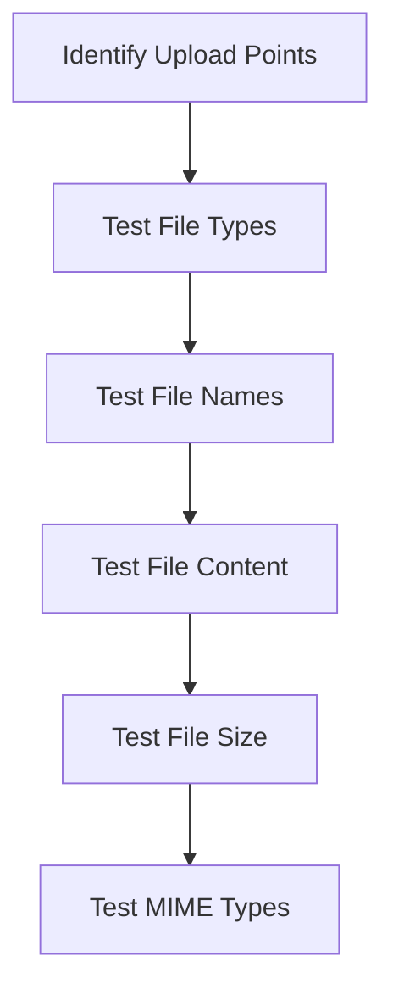

## Black Box Testing

Black box testing is performed with limited knowledge of the internal workings of the application. The tester typically has access only to the URL of the application and the scope of the engagement.

### Steps for Black Box Testing

1. **Identify Upload Points**: Locate all points in the application where users can upload files.
2. **Test File Types**: Attempt to upload different types of files, including executable files (e.g., `.exe`, `.php`), scripts (e.g., `.js`, `.py`), and other potentially harmful file types.
3. **Test File Names**: Try uploading files with unusual or malicious filenames, such as `../etc/passwd`.
4. **Test File Content**: Upload files with known malicious content, such as shell scripts or webshells.
5. **Test File Size**: Attempt to upload large files to check if there are any size restrictions.
6. **Test MIME Types**: Send files with incorrect MIME types to see if the application relies solely on MIME types for validation.

### Example Scenario

Consider a web application that allows users to upload profile pictures. Here’s how you might test this feature:

```markdown
### Step-by-Step Black Box Testing

1. **Identify Upload Points**:
    - Navigate to the profile settings page and locate the file upload button.

2. **Test File Types**:
    - Upload a `.php` file named `shell.php`.

3. **Test File Names**:
    - Upload a file named `../../etc/passwd`.

4. **Test File Content**:
    - Upload a simple PHP shell script:
    ```php
    <?php
    echo "This is a test shell.";
    ?>
    ```

5. **Test File Size**:
    - Attempt to upload a 1GB file.

6. **Test MIME Types**:
    - Send a `.txt` file with a MIME type of `image/jpeg`.
```

### Tools for Black Box Testing

- **Burp Suite**: A comprehensive toolkit for web application security testing.
- **OWASP ZAP**: An open-source web application security scanner.
- **Postman**: Useful for sending custom HTTP requests.

### Mermaid Diagram: Black Box Testing Workflow



---
<!-- nav -->
[[02-What is a File Upload Vulnerability|What is a File Upload Vulnerability]] | [[Web Security (PortSwigger)/18-File Upload Vulnerabilities/01-File Upload Vulnerabilities Complete Guide/00-Overview|Overview]] | [[Web Security (PortSwigger)/18-File Upload Vulnerabilities/01-File Upload Vulnerabilities Complete Guide/04-File Upload Vulnerabilities|File Upload Vulnerabilities]]
