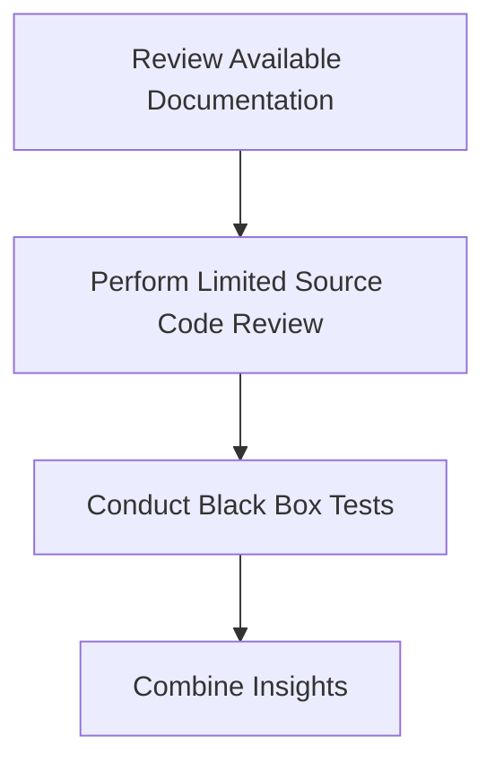

## Gray Box Testing

Gray box testing combines elements of both black box and white box testing. Testers have partial access to the application's internal workings but not full access. This approach is useful when the tester has some knowledge of the application's architecture but lacks full source code access.

### Steps for Gray Box Testing

1. **Review Available Documentation**: Examine any available documentation on the application's architecture.
2. **Perform Limited Source Code Review**: If partial source code is available, review it for potential vulnerabilities.
3. **Conduct Black Box Tests**: Perform standard black box tests to identify vulnerabilities.
4. **Combine Insights**: Use insights from both black box and partial source code reviews to identify vulnerabilities.

### Example Scenario

Consider a scenario where you have access to the application's API documentation but not the full source code. You might perform the following steps:

1. **Review Documentation**: Understand the endpoints and parameters for file uploads.
2. **Limited Source Code Review**: If partial source code is available, review it for validation logic.
3. **Black Box Tests**: Perform standard black box tests to identify vulnerabilities.
4. **Combine Insights**: Use insights from both documentation and partial source code reviews to identify vulnerabilities.

### Mermaid Diagram: Gray Box Testing Workflow

---
<!-- nav -->
[[Web Security (PortSwigger)/18-File Upload Vulnerabilities/01-File Upload Vulnerabilities Complete Guide/04-File Upload Vulnerabilities|File Upload Vulnerabilities]] | [[Web Security (PortSwigger)/18-File Upload Vulnerabilities/01-File Upload Vulnerabilities Complete Guide/00-Overview|Overview]] | [[Web Security (PortSwigger)/18-File Upload Vulnerabilities/01-File Upload Vulnerabilities Complete Guide/06-How to Prevent  Defend Against File Upload Vulnerabilities|How to Prevent  Defend Against File Upload Vulnerabilities]]
