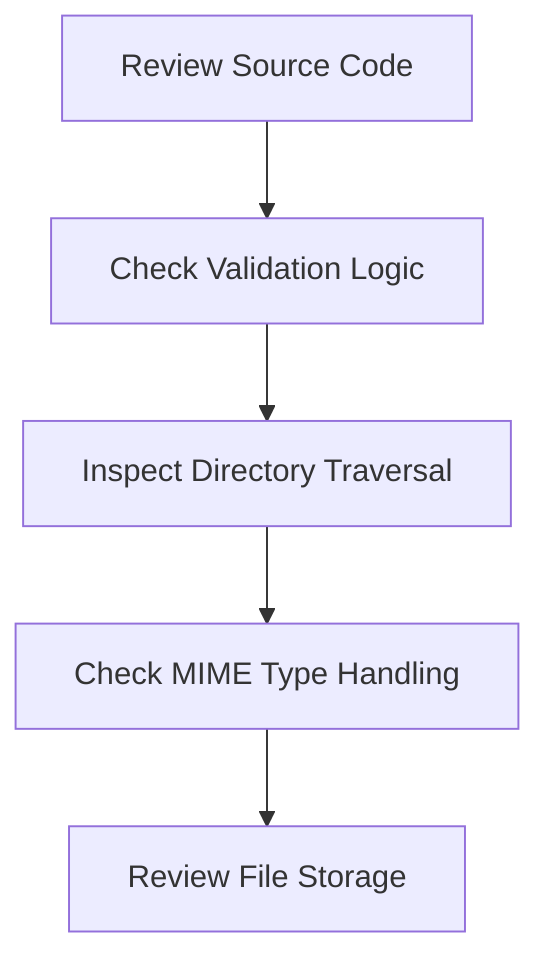

## White Box Testing

White box testing involves having full access to the application's source code and internal workings. This approach allows testers to understand the underlying logic and validate the effectiveness of input sanitization and validation mechanisms.

### Steps for White Box Testing

1. **Review Source Code**: Examine the code responsible for handling file uploads.
2. **Check Validation Logic**: Ensure that the application validates file types, sizes, and content.
3. **Inspect Directory Traversal**: Verify that the application prevents directory traversal attacks.
4. **Check MIME Type Handling**: Ensure that the application does not rely solely on MIME types for validation.
5. **Review File Storage**: Check where uploaded files are stored and ensure they are not accessible via the web.

### Example Scenario

Consider a web application written in Python using Flask. Here’s how you might perform white box testing:

```python
from flask import Flask, request
import os

app = Flask(__name__)

UPLOAD_FOLDER = '/var/www/uploads'
ALLOWED_EXTENSIONS = {'txt', 'pdf', 'png', 'jpg', 'jpeg', 'gif'}

def allowed_file(filename):
    return '.' in filename and \
           filename.rsplit('.', 1)[1].lower() in ALLOWED_EXTENSIONS

@app.route('/upload', methods=['POST'])
def upload_file():
    if 'file' not in request.files:
        return "No file part"
    file = request.files['file']
    if file.filename == '':
        return "No selected file"
    if file and allowed_file(file.filename):
        filename = secure_filename(file.filename)
        file.save(os.path.join(UPLOAD_FOLDER, filename))
        return "File successfully uploaded"
    else:
        return "Invalid file type"

if __name__ == '__main__':
    app.run()
```

### Pitfalls in White Box Testing

- **Inadequate Validation**: Failing to validate file types, sizes, and content.
- **Directory Traversal**: Not preventing directory traversal attacks.
- **MIME Type Reliance**: Relying solely on MIME types for validation.
- **Improper File Storage**: Storing uploaded files in a location accessible via the web.

### Mermaid Diagram: White Box Testing Workflow



---
<!-- nav -->
[[Web Security (PortSwigger)/18-File Upload Vulnerabilities/01-File Upload Vulnerabilities Complete Guide/06-How to Prevent  Defend Against File Upload Vulnerabilities|How to Prevent  Defend Against File Upload Vulnerabilities]] | [[Web Security (PortSwigger)/18-File Upload Vulnerabilities/01-File Upload Vulnerabilities Complete Guide/00-Overview|Overview]] | [[Web Security (PortSwigger)/18-File Upload Vulnerabilities/01-File Upload Vulnerabilities Complete Guide/08-Practice Questions & Answers|Practice Questions & Answers]]
