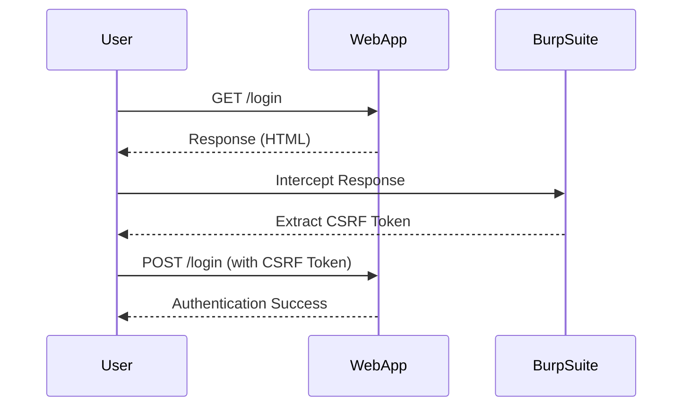
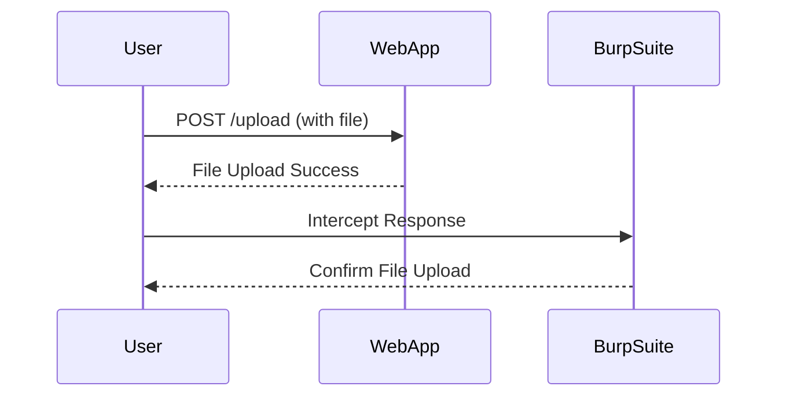
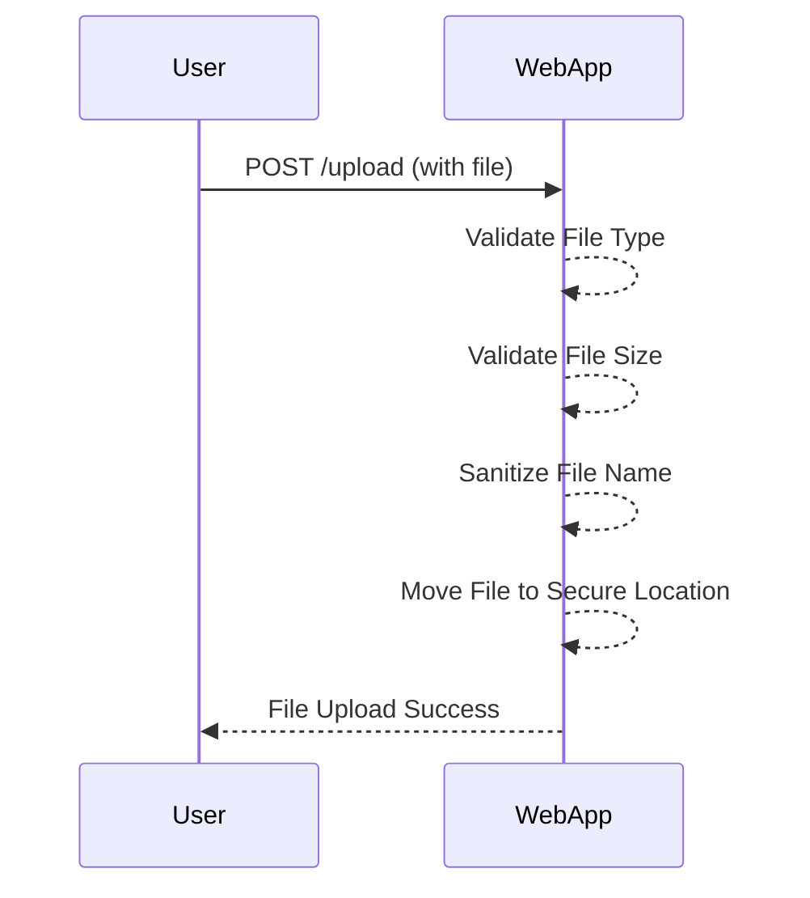

## File Upload Vulnerabilities and Remote Code Execution via Web Shell Upload

### Background Theory

File upload vulnerabilities occur when a web application allows users to upload files to the server without proper validation or sanitization. This can lead to various security issues, including remote code execution (RCE), directory traversal, and cross-site scripting (XSS). In this context, we will focus on RCE via web shell upload, which is a critical vulnerability that can compromise the entire server.

### Understanding the Attack Vector

When a web application allows file uploads, attackers can exploit this feature to upload malicious files, such as web shells. A web shell is a script that provides a command-line interface to the server, allowing attackers to execute arbitrary commands and gain control over the system.

#### Example Scenario

Consider a web application that allows users to upload profile pictures. An attacker could exploit this feature by uploading a PHP web shell instead of a legitimate image file. Once uploaded, the attacker can access the web shell via a URL and execute arbitrary PHP code on the server.

### Real-World Examples

Recent real-world examples of file upload vulnerabilities leading to RCE include:

- **CVE-2021-21972**: A vulnerability in the WordPress plugin "WP File Download" allowed attackers to upload and execute arbitrary PHP files.
- **CVE-2020-14882**: A vulnerability in the Joomla! CMS allowed attackers to upload and execute arbitrary PHP files through the media manager.

These vulnerabilities demonstrate the critical nature of securing file upload functionality in web applications.

### Implementation Details

To understand how to exploit and prevent file upload vulnerabilities, let's walk through the process of logging in to a web application and extracting a CSRF token, which is often required for authenticated file uploads.

#### Logging In and Extracting CSRF Token

The following Python code demonstrates how to log in to a web application and extract a CSRF token:

```python
import requests
from bs4 import BeautifulSoup

def login_and_extract_csrf(url, username, password):
    # Define the login URL
    login_url = url + "/login"
    
    # Create a session object
    session = requests.Session()
    
    # Perform a GET request to the login page to retrieve the CSRF token
    response = session.get(login_url, verify=False, proxies={"http": "http://localhost:8080", "https": "http://localhost:8080"})
    
    # Parse the response using BeautifulSoup
    soup = BeautifulSoup(response.text, 'html.parser')
    
    # Find the CSRF token in the input element
    csrf_token = soup.find('input', {'name': 'csrf'})['value']
    
    # Prepare the login data
    login_data = {
        'username': username,
        'password': password,
        'csrf': csrf_token
    }
    
    # Perform a POST request to log in
    response = session.post(login_url, data=login_data, verify=False, proxies={"http": "http://localhost:8080", "https": "http://localhost:8080"})
    
    return session, csrf_token

# Example usage
url = "http://example.com"
username = "admin"
password = "password"

session, csrf_token = login_and_extract_csrf(url, username, password)
```

### Explanation of the Code

1. **Session Object**: The `requests.Session()` object is used to maintain a persistent connection to the server, which is necessary for handling cookies and other session-related data.
2. **GET Request**: The `session.get()` method is used to send a GET request to the login page. The `verify=False` parameter disables SSL certificate verification, which is useful when working with tools like Burp Suite.
3. **BeautifulSoup Parsing**: The `BeautifulSoup` library is used to parse the HTML response and extract the CSRF token from the input element.
4. **POST Request**: The `session.post()` method is used to send a POST request to the login page with the extracted CSRF token and user credentials.

### Mermaid Diagram: Login and CSRF Extraction Flow



### Uploading a Malicious File

Once authenticated, the attacker can upload a malicious file, such as a PHP web shell. The following code demonstrates how to upload a file:

```python
def upload_file(session, url, file_path):
    # Define the file upload URL
    upload_url = url + "/upload"
    
    # Prepare the file data
    files = {'file': open(file_path, 'rb')}
    
    # Perform a POST request to upload the file
    response = session.post(upload_url, files=files, verify=False, proxies={"http": "http://localhost:8080", "https": "http://localhost:8080"})
    
    return response

# Example usage
file_path = "path/to/malicious.php"
response = upload_file(session, url, file_path)
```

### Explanation of the Code

1. **File Upload URL**: The `upload_url` variable defines the URL for the file upload endpoint.
2. **File Data**: The `files` dictionary contains the file to be uploaded. The `open()` function is used to read the file in binary mode.
3. **POST Request**: The `session.post()` method is used to send a POST request to the file upload endpoint with the file data.

### Mermaid Diagram: File Upload Flow



### Detecting and Preventing File Upload Vulnerabilities

#### Detection

To detect file upload vulnerabilities, you can use automated tools such as:

- **OWASP ZAP**: A free and open-source web application security scanner.
- **Burp Suite**: A comprehensive platform for performing security testing of web applications.

These tools can help identify insecure file upload mechanisms and potential RCE vulnerabilities.

#### Prevention

To prevent file upload vulnerabilities, follow these best practices:

1. **Validate File Types**: Ensure that only allowed file types can be uploaded. Use a whitelist approach to specify permitted file extensions.
2. **Sanitize File Names**: Remove or sanitize file names to prevent directory traversal attacks.
3. **Store Files Securely**: Store uploaded files outside the web root directory to prevent direct access.
4. **Use Content-Type Validation**: Validate the MIME type of uploaded files to ensure they match the expected format.
5. **Limit File Size**: Set a maximum file size limit to prevent resource exhaustion attacks.
6. **Implement Rate Limiting**: Limit the number of file uploads per user to prevent abuse.

### Secure Coding Practices

Here is an example of secure coding practices for file upload functionality:

#### Vulnerable Code

```php
<?php
if ($_FILES["file"]["error"] == UPLOAD_ERR_OK) {
    $filename = $_FILES["file"]["name"];
    move_uploaded_file($_FILES["file"]["tmp_name"], "/var/www/uploads/$filename");
}
?>
```

#### Secure Code

```php
<?php
$allowed_types = ['image/jpeg', 'image/png'];
$max_size = 1024 * 1024; // 1MB

if ($_FILES["file"]["error"] == UPLOAD_ERR_OK) {
    $filename = basename($_FILES["file"]["name"]);
    $filetype = $_FILES["file"]["type"];
    $filesize = $_FILES["file"]["size"];

    if (!in_array($filetype, $allowed_types)) {
        die("Invalid file type.");
    }

    if ($filesize > $max_size) {
        die("File size exceeds the limit.");
    }

    $new_filename = uniqid() . '.' . pathinfo($filename, PATHINFO_EXTENSION);
    move_uploaded_file($_FILES["file"]["tmp_name"], "/var/www/uploads/$new_filename");
}
?>
```

### Mermaid Diagram: Secure File Upload Flow



### Hands-On Labs

To practice and reinforce your understanding of file upload vulnerabilities and RCE via web shell upload, consider the following hands-on labs:

- **PortSwigger Web Security Academy**: Offers interactive labs on file upload vulnerabilities and RCE.
- **OWASP Juice Shop**: A deliberately insecure web application for practicing web security skills.
- **DVWA (Damn Vulnerable Web Application)**: A PHP/MySQL web application that is riddled with vulnerabilities for educational purposes.

By thoroughly understanding and practicing these concepts, you can effectively identify and mitigate file upload vulnerabilities in web applications.

---
<!-- nav -->
[[Web Security (PortSwigger)/18-File Upload Vulnerabilities/02-Lab 1 Remote code execution via web shell upload/01-Introduction to File Upload Vulnerabilities|Introduction to File Upload Vulnerabilities]] | [[Web Security (PortSwigger)/18-File Upload Vulnerabilities/02-Lab 1 Remote code execution via web shell upload/00-Overview|Overview]] | [[03-File Upload Vulnerabilities|File Upload Vulnerabilities]]
