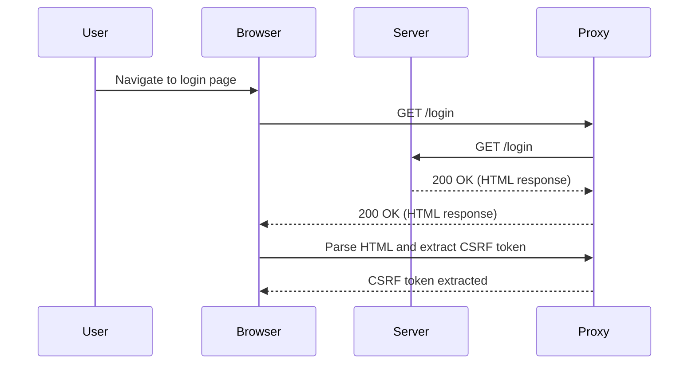
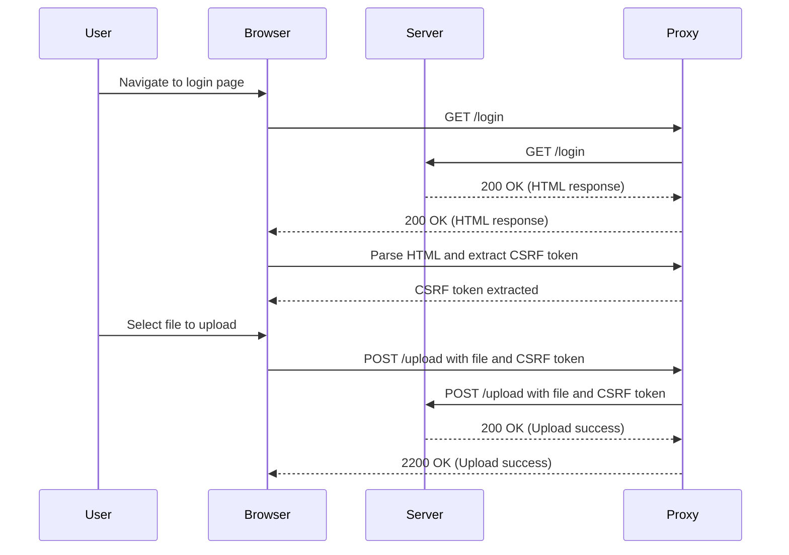

## Understanding CSRF Tokens and File Upload Vulnerabilities

### Background Theory

Cross-Site Request Forgery (CSRF) is a type of attack that tricks a user into executing unwanted actions on a web application in which they are authenticated. A CSRF token is a unique identifier that helps mitigate such attacks by ensuring that the request originates from a legitimate source and not from a malicious third party.

In the context of web applications, especially those involving file uploads, CSRF tokens play a crucial role in preventing unauthorized access and manipulation. When a user logs in or performs an action like uploading a file, the server generates a CSRF token and sends it back to the client. This token is then included in subsequent requests to validate their authenticity.

### File Upload Vulnerabilities

File upload vulnerabilities occur when a web application allows users to upload files without proper validation or sanitization. Attackers can exploit these vulnerabilities to upload malicious files, such as web shells, which can then be used to gain unauthorized access to the server.

#### Path Traversal

Path traversal is a technique used by attackers to access files and directories that are stored outside the web root directory. By manipulating the file path, an attacker can navigate to sensitive areas of the file system and potentially execute arbitrary code.

### Real-World Examples

Recent CVEs and breaches highlight the severity of file upload vulnerabilities:

- **CVE-2021-3513**: A path traversal vulnerability in the WordPress plugin "WP File Download" allowed attackers to upload and execute arbitrary PHP files.
- **CVE-2020-14882**: A path traversal vulnerability in the Joomla component "com_media" enabled attackers to upload and execute arbitrary files.

These examples underscore the importance of robust validation and sanitization mechanisms in web applications.

### Code Example: Extracting CSRF Token

To illustrate the process of extracting a CSRF token, let's walk through a Python script that performs this task. We will use the `requests` library to handle HTTP requests and the `BeautifulSoup` library to parse HTML content.

```python
import requests
from bs4 import BeautifulSoup

def get_csrf_token(session, url):
    # Perform GET request to the login URL
    response = session.get(url, verify=False, proxies={'http': 'http://127.0.0.1:8080', 'https': 'http://127.0.0.1:8080'})
    
    # Parse the response content using BeautifulSoup
    soup = BeautifulSoup(response.text, 'html.parser')
    
    # Find the CSRF token in the HTML form
    csrf_token = soup.find('input', {'name': 'CSRUp'}).get('value')
    
    return csrf_token

# Initialize a session object
session = requests.Session()

# Define the login URL
login_url = 'http://example.com/login'

# Get the CSRF token
csrf_token = get_csrf_token(session, login_url)
print(f"Extracted CSRF Token: {csrf_token}")
```

### Explanation of the Code

1. **Session Object**: The `requests.Session()` object is used to persist certain parameters across requests, such as cookies and headers.
2. **GET Request**: The `session.get()` method sends a GET request to the specified URL. The `verify=False` parameter disables SSL certificate verification, and `proxies` is set to route traffic through a proxy (e.g., Burp Suite).
3. **Parsing HTML**: The `BeautifulSoup` library is used to parse the HTML content of the response. The `find()` method locates the `<input>` element with the `name` attribute set to `CSRUp`.
4. **Extracting Value**: The `get('value')` method retrieves the value of the `value` attribute, which contains the CSRF token.

### Full HTTP Request and Response

Here is the full HTTP request and response for the GET request to the login URL:

```http
GET /login HTTP/1.1
Host: example.com
User-Agent: python-requests/2.25.1
Accept-Encoding: gzip, deflate
Connection: keep-alive
```

```http
HTTP/1.1 200 OK
Date: Mon, 20 Mar 2023 12:00:00 GMT
Server: Apache/2.4.41 (Ubuntu)
Content-Type: text/html; charset=UTF-8
Content-Length: 1234

<!DOCTYPE html>
<html>
<head>
    <title>Login</title>
</head>
<body>
    <form method="POST">
        <input type="hidden" name="CSRUp" value="abcdef123456">
        <!-- Other form elements -->
    </form>
</body>
</html>
```

### Diagram: CSRF Token Extraction Process



### Pitfalls and Common Mistakes

1. **Disabling SSL Verification**: Setting `verify=False` can expose your application to man-in-the-middle attacks. Always ensure SSL verification is enabled in production environments.
2. **Hardcoding Proxies**: Hardcoding proxy settings can lead to issues if the proxy configuration changes. Use environment variables or configuration files to manage proxy settings dynamically.
3. **Ignoring Error Handling**: Proper error handling is essential to catch and respond to unexpected situations, such as network errors or invalid responses.

### How to Prevent / Defend

#### Detection

- **Logging and Monitoring**: Implement logging and monitoring to detect unusual patterns in file uploads and requests.
- **Security Tools**: Use security tools like Burp Suite, OWASP ZAP, or commercial solutions to scan for vulnerabilities.

#### Prevention

- **Input Validation**: Validate and sanitize all user inputs to prevent path traversal and other injection attacks.
- **File Type Checking**: Ensure that uploaded files match expected types and extensions.
- **Content Scanning**: Use antivirus software to scan uploaded files for malware.

#### Secure Coding Fixes

**Vulnerable Code**

```python
def upload_file(file):
    filename = file.filename
    file.save('/uploads/' + filename)
```

**Secure Code**

```python
import os
from werkzeug.utils import secure_filename

def upload_file(file):
    filename = secure_filename(file.filename)
    file.save(os.path.join('/uploads/', filename))
```

### Complete Example: Uploading a File with CSRF Token

Let's extend the previous example to include the file upload process, including the use of the CSRF token.

```python
import requests
from bs4 import BeautifulSoup

def get_csrf_token(session, url):
    response = session.get(url, verify=False, proxies={'http': 'http://127.0.0.1:8080', 'https': 'http://127.0.0.1:8080'})
    soup = BeautifulSoup(response.text, 'html.parser')
    csrf_token = soup.find('input', {'name': 'CSRUp'}).get('value')
    return csrf_token

def upload_file(session, url, csrf_token, file_path):
    with open(file_path, 'rb') as file:
        files = {'file': (os.path.basename(file_path), file)}
        data = {'CSRUp': csrf_token}
        response = session.post(url, data=data, files=files, verify=False, proxies={'http': 'http://127.0.0.1:8080', 'https': 'http://127.0.0.1:8080'})
        return response.status_code

# Initialize a session object
session = requests.Session()

# Define the login URL and file upload URL
login_url = 'http://example.com/login'
upload_url = 'http://example.com/upload'

# Get the CSRF token
csrf_token = get_csrf_token(session, login_url)

# Upload a file
file_path = '/path/to/file.txt'
status_code = upload_file(session, upload_url, csrf_token, file_path)
print(f"File upload status: {status_code}")
```

### Full HTTP Request and Response for File Upload

Here is the full HTTP request and response for the POST request to upload a file:

```http
POST /upload HTTP/1.1
Host: example.com
User-Agent: python-requests/2.25.1
Accept-Encoding: gzip, deflate
Connection: keep-alive
Content-Type: multipart/form-data; boundary=------------------------boundary
Content-Length: 1234

--------------------------boundary
Content-Disposition: form-data; name="CSRUp"

abcdef123456
--------------------------boundary
Content-Disposition: form-data; name="file"; filename="file.txt"
Content-Type: text/plain

(file contents)
--------------------------boundary--
```

```http
HTTP/1.1 200 OK
Date: Mon, 20 Mar 2023 12:00:00 GMT
Server: Apache/2.4.41 (Ubuntu)
Content-Type: text/html; charset=UTF-8
Content-Length: 1234

<!DOCTYPE html>
<html>
<head>
    <title>Upload Success</title>
</head>
<body>
    <h1>File uploaded successfully</h1>
</body>
</html>
```

### Diagram: File Upload Process with CSRF Token



### Conclusion

Understanding and mitigating file upload vulnerabilities, particularly those involving path traversal and CSRF tokens, is crucial for securing web applications. By following best practices, implementing robust validation mechanisms, and using secure coding techniques, developers can significantly reduce the risk of exploitation.

### Practice Labs

For hands-on practice with file upload vulnerabilities and CSRF tokens, consider the following labs:

- **PortSwigger Web Security Academy**: Offers comprehensive modules on web security, including file upload vulnerabilities and CSRF attacks.
- **OWASP Juice Shop**: A deliberately insecure web application for practicing various web security techniques.
- **DVWA (Damn Vulnerable Web Application)**: Provides a range of vulnerabilities, including file upload and CSRF, for educational purposes.

By engaging with these labs, you can gain practical experience in identifying and mitigating file upload vulnerabilities.

---
<!-- nav -->
[[Web Security (PortSwigger)/18-File Upload Vulnerabilities/04-Lab 3 Web shell upload via path traversal/05-File Upload Vulnerabilities|File Upload Vulnerabilities]] | [[Web Security (PortSwigger)/18-File Upload Vulnerabilities/04-Lab 3 Web shell upload via path traversal/00-Overview|Overview]] | [[Web Security (PortSwigger)/18-File Upload Vulnerabilities/04-Lab 3 Web shell upload via path traversal/07-Practice Questions & Answers|Practice Questions & Answers]]
