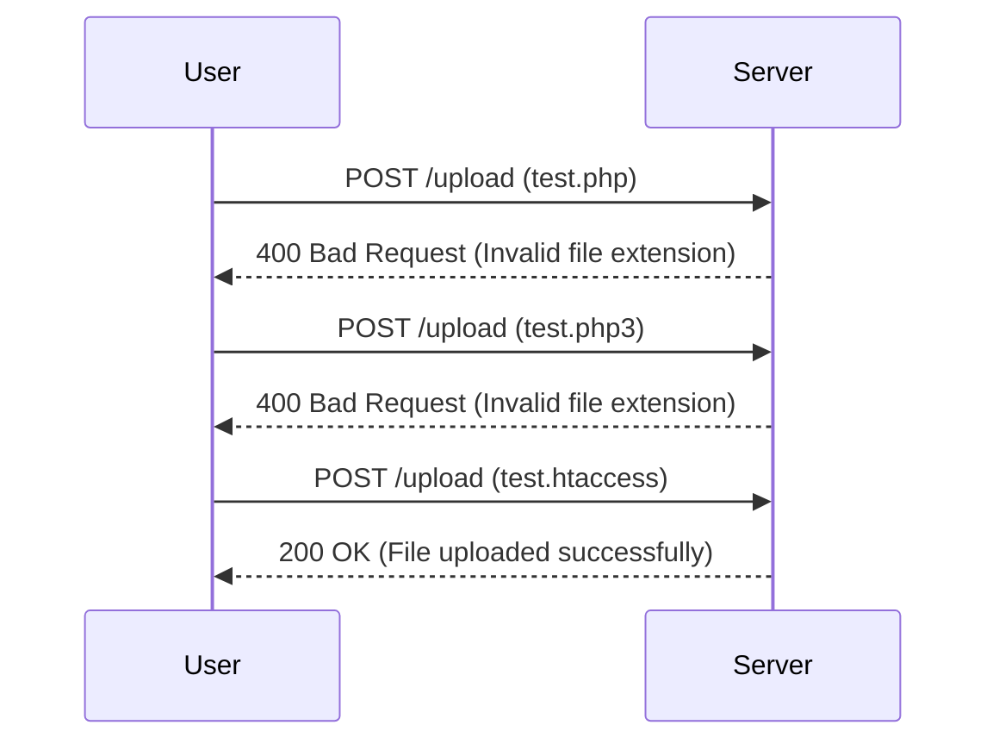

## File Upload Vulnerabilities

### Introduction

File upload vulnerabilities occur when an application allows users to upload files to the server without proper validation or sanitization. This can lead to various security issues, including remote code execution, directory traversal, and data leakage. In this section, we will delve into the specifics of a common scenario: uploading a web shell via an extension blacklist bypass.

### Understanding the Scenario

In the given scenario, the attacker attempts to upload a PHP script to the server. However, the server rejects the upload due to an extension blacklist that disallows `.php` files. The attacker then tries to bypass this restriction by using different file extensions such as `.php2`, `.php3`, `.php4`, etc., but these also fail. Finally, the attacker discovers that the server accepts `.htaccess` files, which can be used to execute arbitrary commands.

### Background Theory

#### What is a Web Shell?

A web shell is a malicious script that provides an attacker with remote control over a web server. It typically consists of a small piece of code that listens for commands and executes them on the server. Common web shells include `c99.php`, `webshell.aspx`, and `cmd.jsp`.

#### Why is File Upload Important?

File uploads are a common feature in web applications, allowing users to share documents, images, and other media. However, if not properly secured, they can be exploited to upload malicious files, leading to severe security breaches.

#### How Does Extension Blacklisting Work?

Extension blacklisting is a method of preventing certain types of files from being uploaded. The server checks the file extension against a list of allowed or disallowed extensions. If the file extension is on the disallowed list, the upload is rejected.

### Real-World Examples

#### Recent Breaches

One notable example of a file upload vulnerability is the case of the Equifax breach in 2017. Hackers exploited a vulnerability in Apache Struts, which allowed them to upload a web shell and gain unauthorized access to sensitive data.

#### CVEs

- **CVE-2017-5638**: A critical vulnerability in Apache Struts allowed attackers to upload a web shell and execute arbitrary commands.
- **CVE-2019-11510**: A vulnerability in the WordPress REST API allowed attackers to upload and execute PHP files.

### Detailed Walkthrough

#### Initial Attack Attempt

The attacker first tries to upload a PHP script with the `.php` extension:

```http
POST /upload HTTP/1.1
Host: vulnerable.example.com
Content-Type: multipart/form-data; boundary=----WebKitFormBoundary7MA4YWxkTrZu0gW
Content-Length: 146

------WebKitFormBoundary7MA4YWxkTrZu0gW
Content-Disposition: form-data; name="file"; filename="test.php"
Content-Type: application/x-php

<?php echo "Hello, World!"; ?>
------WebKitFormBoundary7MA4YWxkTrZu0gW--
```

The server responds with an error indicating that the file extension is not allowed:

```http
HTTP/1.1 400 Bad Request
Content-Type: text/html; charset=UTF-8
Content-Length: 123

<!DOCTYPE html>
<html>
<head>
<title>Error</title>
</head>
<body>
<h1>Invalid file extension</h1>
<p>The file extension .php is not allowed.</p>
</body>
</html>
```

#### Bypassing the Extension Blacklist

The attacker then tries different file extensions to bypass the blacklist:

```http
POST /upload HTTP/1.1
Host: vulnerable.example.com
Content-Type: multipart/form-data; boundary=----WebKitFormBoundary7MA4YWxkTrZu0gW
Content-Length: 147

------WebKitFormBoundary7MA4YWxkTrZu0gW
Content-Disposition: form-data; name="file"; filename="test.php3"
Content-Type: application/x-php

<?php echo "Hello, World!"; ?>
------WebKitFormBoundary7MA4YWxkTrZu0gW--
```

This attempt also fails, but the attacker eventually discovers that `.htaccess` files are accepted:

```http
POST /upload HTTP/1.1
Host: vulnerable.example.com
Content-Type: multipart/form-data; boundary=----WebKitFormBoundary7MA4YWxkTrZu0gW
Content-Length: 150

------WebKitFormBoundary7MA4YWxkTrZu0gW
Content-Disposition: form-data; name="file"; filename="test.htaccess"
Content-Type: text/plain

AddType application/x-httpd-php .htaccess
<Files ~ "\.htaccess$">
Order allow,deny
Allow from all
</Files>
------WebKitFormBoundary7MA4YWxkTrZu0gW--
```

The server accepts the `.htaccess` file, and the attacker can now execute PHP code through the `.htaccess` file.

### Mermaid Diagrams

#### Attack Chain



### Pitfalls and Common Mistakes

#### Incorrect Validation

One common mistake is relying solely on client-side validation for file uploads. Client-side validation can be easily bypassed, so server-side validation is essential.

#### Incomplete Blacklists

Blacklists should be comprehensive and cover all possible variations of disallowed file extensions. Relying on incomplete blacklists can leave the application vulnerable to bypasses.

### How to Prevent / Defend

#### Secure Coding Practices

To prevent file upload vulnerabilities, follow these secure coding practices:

1. **Validate File Extensions**: Ensure that only allowed file extensions are accepted. Use a whitelist approach rather than a blacklist.
2. **Check MIME Types**: Verify the MIME type of the uploaded file to ensure it matches the expected type.
3. **Limit File Size**: Set a maximum file size to prevent denial-of-service attacks.
4. **Use Content-Security Policies**: Implement Content-Security-Policies (CSP) to restrict the sources from which resources can be loaded.

#### Example Secure Code

Here is an example of secure code for handling file uploads:

```php
<?php
$allowedExtensions = ['jpg', 'jpeg', 'png'];
$maxFileSize = 5 * 1024 * 1024; // 5MB

if ($_FILES['file']['error'] === UPLOAD_ERR_OK) {
    $tempFile = $_FILES['file']['tmp_name'];
    $fileName = basename($_FILES['file']['name']);
    $fileSize = $_FILES['file']['size'];
    $fileExtension = pathinfo($fileName, PATHINFO_EXTENSION);

    if (!in_array(strtolower($fileExtension), $allowedExtensions)) {
        die('Invalid file extension.');
    }

    if ($fileSize > $maxFileSize) {
        die('File size exceeds the limit.');
    }

    $mimeType = mime_content_type($tempFile);
    if (!in_array($mimeType, ['image/jpeg', 'image/png'])) {
        die('Invalid file type.');
    }

    move_uploaded_file($tempFile, "/path/to/upload/directory/$fileName");
    echo "File uploaded successfully.";
} else {
    die('Upload failed.');
}
?>
```

#### Hardening Measures

1. **Disable Dangerous Features**: Disable features like `mod_rewrite` and `AddHandler` in `.htaccess` files to prevent the execution of arbitrary scripts.
2. **Use Secure Headers**: Implement secure headers such as `X-Content-Type-Options: nosniff` to prevent browsers from interpreting files incorrectly.
3. **Regular Audits**: Conduct regular security audits and penetration testing to identify and mitigate vulnerabilities.

### Conclusion

File upload vulnerabilities can lead to serious security breaches if not properly handled. By following secure coding practices, implementing comprehensive validation, and regularly auditing your application, you can significantly reduce the risk of such vulnerabilities. Always stay informed about the latest security trends and best practices to keep your application secure.

### Practice Labs

For hands-on practice with file upload vulnerabilities, consider the following labs:

- **PortSwigger Web Security Academy**: Offers a variety of labs covering different aspects of web security, including file upload vulnerabilities.
- **OWASP Juice Shop**: A deliberately insecure web application for practicing web security skills.
- **DVWA (Damn Vulnerable Web Application)**: A PHP/MySQL web application that is riddled with vulnerabilities for educational purposes.

These labs provide a safe environment to learn and practice securing web applications against file upload vulnerabilities.

---
<!-- nav -->
[[03-File Upload Vulnerabilities and Web Shell Upload via Extension Blacklist Bypass|File Upload Vulnerabilities and Web Shell Upload via Extension Blacklist Bypass]] | [[Web Security (PortSwigger)/18-File Upload Vulnerabilities/05-Lab 4 Web shell upload via extension blacklist bypass/00-Overview|Overview]] | [[05-Understanding CSRF Tokens and Their Role in Web Security|Understanding CSRF Tokens and Their Role in Web Security]]
