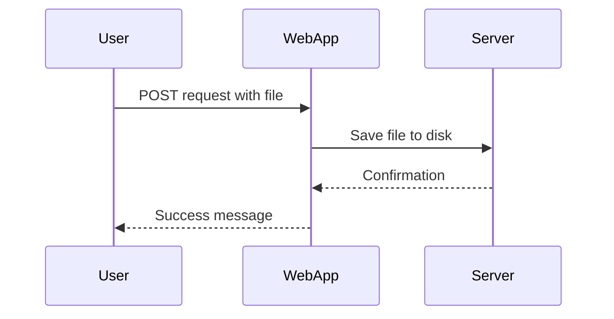

## File Upload Vulnerabilities and Remote Code Execution via Polyglot Web Shells

### Introduction to File Upload Vulnerabilities

File upload vulnerabilities occur when a web application allows users to upload files without proper validation or sanitization. This can lead to various security issues, including remote code execution (RCE), cross-site scripting (XSS), and directory traversal attacks. In this section, we will focus on RCE through the use of polyglot web shells.

#### What is a Polyglot Web Shell?

A polyglot web shell is a malicious script designed to bypass file type checks and execute arbitrary code on the server. These scripts are crafted to appear as legitimate files (e.g., images, documents) while also containing executable code (e.g., PHP, JavaScript).

#### Why Are Polyglot Web Shells Dangerous?

Polyglot web shells are dangerous because they can evade basic file type checks. For instance, an attacker might upload a file that appears to be an image but contains hidden PHP code. When the server processes this file, the embedded PHP code can be executed, leading to RCE.

### Background Theory

To understand how file upload vulnerabilities work, let's first look at the typical process of file uploads in web applications:



In a secure environment, the web application should validate the file type and content before saving it to the server. However, if these checks are weak or missing, an attacker can exploit this vulnerability.

### Real-World Examples

Recent real-world examples of file upload vulnerabilities include:

- **CVE-2021-3014**: A vulnerability in the WordPress plugin "WP File Manager" allowed attackers to upload and execute arbitrary PHP files.
- **CVE-2020-14882**: A vulnerability in the Joomla! CMS allowed attackers to upload and execute arbitrary PHP files.

These vulnerabilities highlight the importance of proper file validation and sanitization.

### Exploiting File Upload Vulnerabilities

Let's walk through a detailed example of how an attacker might exploit a file upload vulnerability to achieve RCE using a polyglot web shell.

#### Step-by-Step Exploit Process

1. **Identify the Vulnerability**:
   - Determine if the web application allows file uploads.
   - Check if the application performs weak or no file type validation.

2. **Craft the Polyglot Web Shell**:
   - Create a file that appears to be a legitimate image but contains hidden PHP code.

Here is an example of a polyglot web shell:

```php
<?php
// Hidden PHP code
echo "Remote code execution successful!";
?>
```

This PHP code is embedded within a seemingly benign image file.

3. **Upload the File**:
   - Use a tool like `curl` or a browser to upload the crafted file to the web application.

Example using `curl`:

```bash
curl -F "file=@polyglot_shell.php.jpg" http://example.com/upload.php
```

4. **Execute the Code**:
   - Access the uploaded file via the web application to trigger the execution of the hidden PHP code.

Example URL:

```
http://example.com/uploads/polyglot_shell.php.jpg
```

### Full HTTP Request and Response Example

#### HTTP Request

```http
POST /upload.php HTTP/1.1
Host: example.com
Content-Type: multipart/form-data; boundary=----WebKitFormBoundary7MA4YWxkTrZu0gW
Content-Length: 1234

------WebKitFormBoundary7MA4YWxkTrZu0gW
Content-Disposition: form-data; name="file"; filename="polyglot_shell.php.jpg"
Content-Type: image/jpeg

[Binary data]
------WebKitFormBoundary7MA4YWxkTrZu0gW--
```

#### HTTP Response

```http
HTTP/1.1 200 OK
Date: Mon, 20 Mar 2023 12:00:00 GMT
Server: Apache/2.4.41 (Ubuntu)
Content-Type: text/html; charset=UTF-8
Content-Length: 123

File uploaded successfully.
```

### How to Prevent / Defend Against File Upload Vulnerabilities

#### Detection

- **Logging and Monitoring**: Implement logging and monitoring to detect unusual file uploads or access patterns.
- **Intrusion Detection Systems (IDS)**: Use IDS to identify and alert on suspicious activities related to file uploads.

#### Prevention

- **Strict File Type Validation**: Ensure that the web application validates the MIME type and file extension of uploaded files.
- **Content Filtering**: Use content filtering tools to scan uploaded files for malicious content.
- **Secure File Storage**: Store uploaded files outside the web root directory to prevent direct access.

#### Secure Coding Fixes

##### Vulnerable Code

```php
<?php
if ($_FILES['file']['error'] == UPLOAD_ERR_OK) {
    $filename = basename($_FILES['file']['name']);
    move_uploaded_file($_FILES['file']['tmp_name'], "uploads/$filename");
}
?>
```

##### Secure Code

```php
<?php
if ($_FILES['file']['error'] == UPLOAD_ERR_OK) {
    $allowedTypes = ['image/jpeg', 'image/png'];
    $filename = basename($_FILES['file']['name']);
    $fileType = $_FILES['file']['type'];

    if (in_array($fileType, $allowedTypes)) {
        $newFilename = uniqid() . '.' . pathinfo($filename, PATHINFO_EXTENSION);
        move_uploaded_file($_FILES['file']['tmp_name'], "uploads/$newFilename");
    } else {
        echo "Invalid file type.";
    }
}
?>
```

### Configuration Hardening

#### Web Server Configuration

Ensure that the web server is configured to restrict access to uploaded files. For example, in Apache, you can use the following configuration:

```apache
<Directory "/var/www/html/uploads">
    Order Deny,Allow
    Deny from all
</Directory>
```

#### Application-Level Configuration

Configure the application to store uploaded files in a non-web-accessible directory and serve them through a proxy script.

### Hands-On Practice Labs

For hands-on practice with file upload vulnerabilities, consider the following labs:

- **PortSwigger Web Security Academy**: Offers interactive labs on file upload vulnerabilities.
- **OWASP Juice Shop**: Contains several challenges related to file upload vulnerabilities.
- **DVWA (Damn Vulnerable Web Application)**: Provides a variety of file upload vulnerabilities for testing and learning.

### Conclusion

File upload vulnerabilities are a significant threat to web applications. By understanding the mechanics of these vulnerabilities and implementing robust detection and prevention measures, developers can significantly reduce the risk of exploitation. Always ensure that file uploads are properly validated and sanitized to prevent remote code execution and other security issues.

---
<!-- nav -->
[[04-File Upload Vulnerabilities and Polyglot Web Shells|File Upload Vulnerabilities and Polyglot Web Shells]] | [[Web Security (PortSwigger)/18-File Upload Vulnerabilities/07-Lab 6 Remote code execution via polyglot web shell upload/00-Overview|Overview]] | [[Web Security (PortSwigger)/18-File Upload Vulnerabilities/07-Lab 6 Remote code execution via polyglot web shell upload/06-How to Prevent  Defend Against File Upload Vulnerabilities|How to Prevent  Defend Against File Upload Vulnerabilities]]
