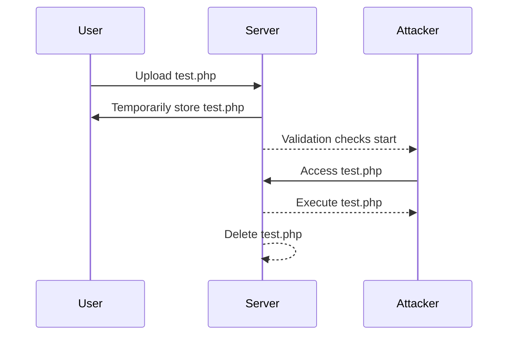

## File Upload Vulnerabilities: Race Condition Exploitation

### Introduction to File Upload Vulnerabilities

File upload vulnerabilities occur when a web application allows users to upload files to the server without proper validation or sanitization. This can lead to various security issues, such as remote code execution, data leakage, or denial of service attacks. One specific type of file upload vulnerability is the race condition, which occurs due to the timing gap between file validation and actual processing.

### Understanding Race Conditions in File Uploads

A race condition in file uploads happens when there is a small window of time during which an uploaded file can be accessed before the server completes its validation process. In the given scenario, the server checks the file type and virus status, but there is a brief moment when the file is present in the directory before these checks are completed. If the file is not a valid image (JPEG or PNG), it is subsequently deleted.

#### Detailed Explanation of the Race Condition

1. **File Upload Process**:
    - A user uploads a file to the server.
    - The server temporarily stores the file in a directory.
    - The server performs checks to validate the file type and scan for viruses.
    - If the file passes the checks, it remains in the directory; otherwise, it is deleted.

2. **Race Condition Scenario**:
    - An attacker uploads a malicious file (e.g., a PHP script) disguised as a valid image.
    - The server temporarily stores the file.
    - Before the server completes its validation checks, the attacker attempts to access the file.
    - If successful, the attacker can execute the malicious file before it is detected and deleted.

### Example of Race Condition Exploitation

Consider a web application that allows users to upload profile pictures. The application checks if the uploaded file is a valid image and scans it for viruses. However, there is a brief period when the file is stored in the `/uploads` directory before these checks are completed.

#### Step-by-Step Exploitation

1. **Upload Malicious File**:
    - The attacker uploads a PHP script (`test.php`) disguised as a valid image.
    - The server temporarily stores the file in `/uploads`.

2. **Access the File**:
    - The attacker quickly accesses the file using a URL like `http://example.com/uploads/test.php`.
    - If the server has not yet completed the validation checks, the attacker can execute the PHP script.

3. **Exploit the Script**:
    - The PHP script can contain malicious code to gain unauthorized access or perform other harmful actions.

### Code Example of Race Condition Exploitation

```php
// Malicious PHP script (test.php)
<?php
system($_GET['cmd']);
?>
```

#### HTTP Request and Response

```http
POST /upload HTTP/1.1
Host: example.com
Content-Type: multipart/form-data; boundary=----WebKitFormBoundary7MA4YWxkTrZu0gW

------WebKitFormBoundary7MA4YWxkTrZu0gW
Content-Disposition: form-data; name="file"; filename="test.php"
Content-Type: application/octet-stream

<?php system($_GET['cmd']); ?>
------WebKitFormBoundary7MA4YWxkTrZu0gW--
```

```http
HTTP/1.1 200 OK
Date: Mon, 23 Jan 2023 12:00:00 GMT
Server: Apache/2.4.41 (Ubuntu)
Content-Length: 0
Content-Type: text/html; charset=UTF-8
```

### Using Turbo Intruder for Exploitation

Turbo Intruder is an extension for Burp Suite that automates the exploitation of race conditions. It allows attackers to send multiple requests in rapid succession to increase the chances of exploiting the race condition.

#### Installation and Usage of Turbo Intruder

1. **Install Turbo Intruder**:
    - Open Burp Suite.
    - Go to `Extender` > `BApp Store`.
    - Search for `Turbo Intruder`.
    - Click `Install`.

2. **Configure Turbo Intruder**:
    - Add the URL of the uploaded file to Turbo Intruder.
    - Set the number of requests to send (e.g., 100).

3. **Execute the Attack**:
    - Run Turbo Intruder to send multiple requests to the server.
    - If successful, the attacker can access and execute the malicious file.

### Mermaid Diagram of Race Condition Exploitation



### Real-World Examples and Recent Breaches

#### CVE-2021-3116: WordPress Plugin Vulnerability

In 2021, a vulnerability was discovered in the WordPress plugin "WP File Manager." The plugin allowed users to upload files without proper validation, leading to a race condition that could be exploited to upload and execute malicious scripts.

#### How to Prevent / Defend Against Race Condition Exploits

1. **Secure File Upload Mechanism**:
    - Implement strict file type validation.
    - Use a temporary directory for file uploads.
    - Perform all validation checks before moving the file to the final destination.

2. **Code Example of Secure File Upload**

```php
// Secure file upload mechanism
if ($_FILES['file']['error'] === UPLOAD_ERR_OK) {
    $tempFile = $_FILES['file']['tmp_name'];
    $fileName = basename($_FILES['file']['name']);
    $fileType = pathinfo($fileName, PATHINFO_EXTENSION);

    // Validate file type
    if ($fileType !== 'jpg' && $fileType !== 'png') {
        unlink($tempFile);
        die('Invalid file type.');
    }

    // Scan for viruses
    if (!isClean($tempFile)) {
        unlink($tempFile);
        die('Virus detected.');
    }

    // Move file to final destination
    move_uploaded_file($tempFile, "/uploads/$fileName");
}
```

#### Detection and Prevention Techniques

1. **Detection**:
    - Monitor file upload directories for unexpected file types.
    - Use intrusion detection systems (IDS) to detect suspicious activities.

2. **Prevention**:
    - Harden server configurations to restrict file execution permissions.
    - Regularly update and patch web applications to fix known vulnerabilities.

### Practice Labs for Web Application Security

For hands-on practice with file upload vulnerabilities, consider the following labs:

- **PortSwigger Web Security Academy**: Offers interactive labs on file upload vulnerabilities.
- **OWASP Juice Shop**: Provides a vulnerable web application for practicing various security exploits.
- **DVWA (Damn Vulnerable Web Application)**: Contains multiple vulnerabilities, including file upload issues.

By thoroughly understanding and implementing the preventive measures, developers can significantly reduce the risk of file upload vulnerabilities in their web applications.

---
<!-- nav -->
[[Web Security (PortSwigger)/18-File Upload Vulnerabilities/08-Lab 7 Web shell upload via race condition/01-Introduction to File Upload Vulnerabilities|Introduction to File Upload Vulnerabilities]] | [[Web Security (PortSwigger)/18-File Upload Vulnerabilities/08-Lab 7 Web shell upload via race condition/00-Overview|Overview]] | [[03-File Upload Vulnerabilities and Race Conditions|File Upload Vulnerabilities and Race Conditions]]
