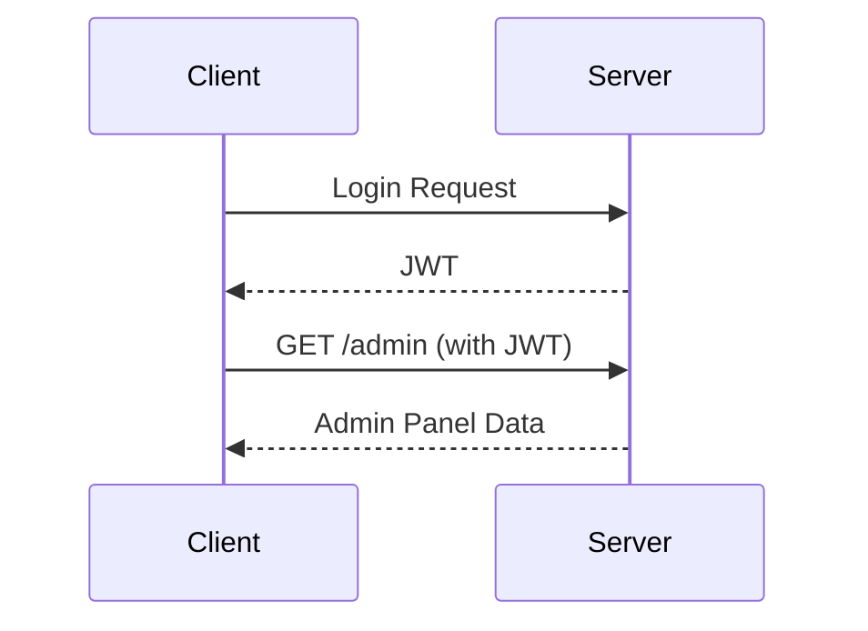

## Introduction to JWT and Its Role in Web Security

### What is JWT?

JSON Web Tokens (JWT) are a compact, URL-safe means of representing claims to be transferred between two parties. They are commonly used for authentication and information exchange between a client and a server. A JWT consists of three parts separated by dots (`.`):

1. **Header**: Contains metadata about the token, such as the type of token and the signing algorithm being used.
2. **Payload**: Contains the claims, which are statements about an entity (typically the user) and additional data.
3. **Signature**: Ensures the integrity of the token and verifies that it was issued by a trusted party.

### Why Use JWT?

JWTs are widely adopted because they provide a stateless way to manage user sessions. Instead of storing session information on the server, JWTs allow the server to send a token to the client, which can then be used to authenticate subsequent requests. This makes JWTs particularly useful in distributed systems and microservices architectures.

### How JWT Works Under the Hood

When a user logs in, the server generates a JWT and sends it to the client. The client stores this token (usually in local storage or cookies) and includes it in the `Authorization` header of subsequent requests. The server then verifies the token to ensure it hasn't been tampered with and that it was issued by a trusted party.

### Real-World Example: CVE-2021-21972

In 2021, a critical vulnerability was discovered in the Spring Framework, which allowed attackers to bypass authentication by manipulating JWTs. This vulnerability, identified as CVE-2021-21972, affected many applications built on the Spring framework. Attackers could craft a malicious JWT that would be accepted by the server, leading to unauthorized access.

### Common Pitfalls Without Proper JWT Implementation

Without proper verification of the JWT signature, an attacker can manipulate the token to gain unauthorized access. This is precisely the scenario we will explore in this lab.

---
<!-- nav -->
[[03-Introduction to JWT and CSRF Tokens|Introduction to JWT and CSRF Tokens]] | [[Web Security (PortSwigger)/19-JWT Attacks/01-Lab 1 JWT authentication bypass via unverified signature/00-Overview|Overview]] | [[05-JWT Attacks Overview|JWT Attacks Overview]]
