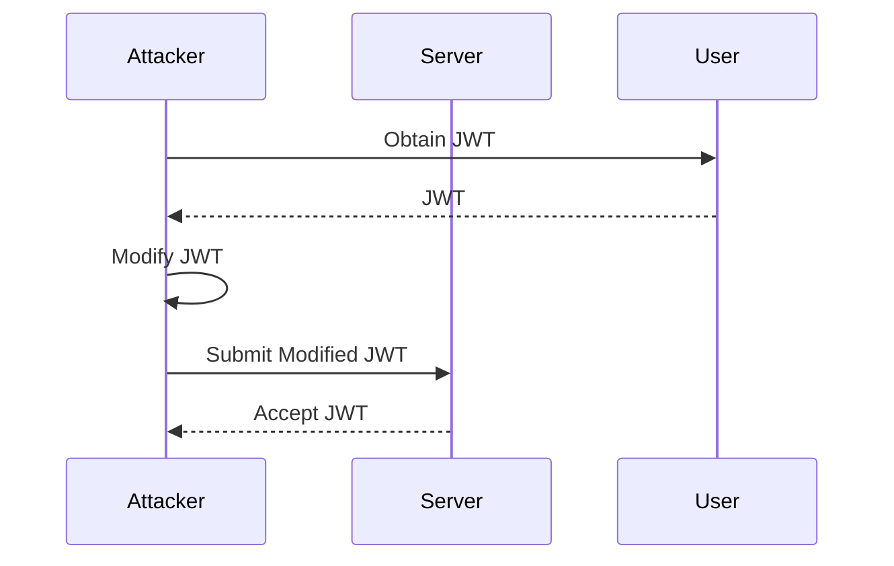

## Hands-On Practice Labs

For hands-on practice with JWT authentication bypass and other web security topics, consider the following labs:

- **PortSwigger Web Security Academy**: Offers comprehensive labs covering various web security topics, including JWT manipulation.
- **OWASP Juice Shop**: A deliberately insecure web application for practicing web security skills.
- **DVWA (Damn Vulnerable Web Application)**: A PHP/MySQL web application that is riddled with vulnerabilities for educational purposes.
- **WebGoat**: An interactive, gamified training application for learning about web security.

These labs provide real-world scenarios and challenges to help you master web security concepts and techniques.

### Mermaid Diagrams

#### JWT Structure Diagram

```mermaid
graph LR
    JWT -->|Base64UrlEncode| Header
    JWT -->|Base64UrlEncode| Payload
    JWT -->|Signature| Signature
    Header -->|Metadata| {"alg":"HS256","typ":"JWT"}
    Payload -->|Claims| {"sub":"1234567890","name":"John Doe","iat":1516239022}
    Signature -->|Verification| SflKxwRJSMeKKF2QT4fwpMeJf36POk6yJV_adQssw5c
```

#### JWT Attack Chain Diagram



By following these steps and understanding the underlying mechanisms, you can effectively prevent and defend against JWT authentication bypass attacks.

---
<!-- nav -->
[[07-Decoding and Modifying JWT Headers and Payloads|Decoding and Modifying JWT Headers and Payloads]] | [[Web Security (PortSwigger)/19-JWT Attacks/02-Lab 2 JWT authentication bypass via flawed signature verification/00-Overview|Overview]] | [[09-JSON Web Tokens (JWT)|JSON Web Tokens (JWT)]]
