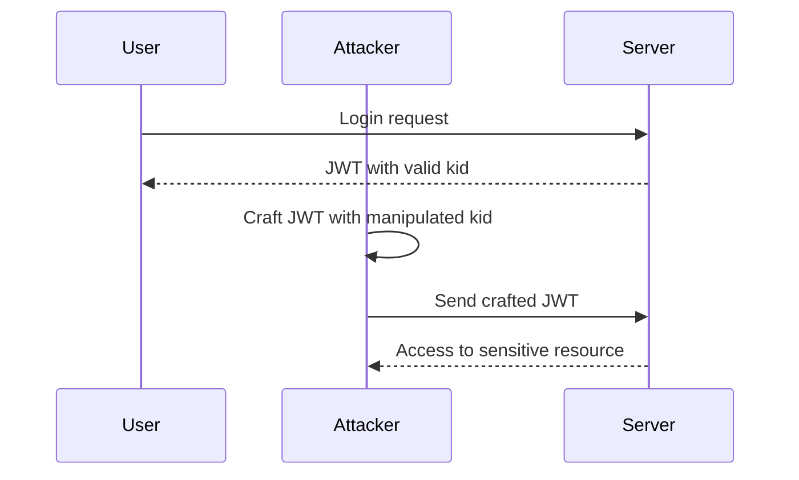

## Understanding Path Traversal Attacks

Path traversal attacks occur when an attacker manipulates input to access files or directories that should not be accessible. This can lead to unauthorized access to sensitive information or even remote code execution.

### How Path Traversal Works

In the context of JWTs, the `kid` header is used to specify which key should be used to verify the token's signature. If the server improperly handles the `kid` value, an attacker could manipulate it to access arbitrary files on the server's filesystem.

For example, consider a server that uses the `kid` value to load a public key from a specific directory. If the server does not properly validate the `kid` value, an attacker could provide a value like `../../etc/passwd` to access the `/etc/passwd` file on a Unix-like system.

### Real-World Example: CVE-2021-21315

CVE-2021-21315 is a real-world example of a path traversal vulnerability in the `jwt-go` library, which is commonly used in Go applications. The vulnerability allowed attackers to bypass authentication by manipulating the `kid` header. This led to unauthorized access to sensitive resources and potential data exfiltration.

### Steps to Exploit Path Traversal in JWT

To exploit a path traversal vulnerability in JWT, an attacker would follow these steps:

1. Identify the endpoint that accepts JWTs.
2. Craft a JWT with a manipulated `kid` value.
3. Send the crafted JWT to the server and observe the response.

### Example of Crafting a Malicious JWT

Here is an example of crafting a malicious JWT with a manipulated `kid` value:

```python
import jwt

# Define the payload
payload = {
    "sub": "1234567890",
    "name": "John Doe",
    "iat": 1516239022,
    "iss": "https://example.com",
    "aud": "https://example.com/admin"
}

# Define the header with a manipulated kid value
header = {
    "alg": "HS256",
    "typ": "JWT",
    "kid": "../../etc/passwd"
}

# Generate the JWT
token = jwt.encode(payload, "secret", algorithm="HS256", headers=header)

print(token)
```

This code generates a JWT with a manipulated `kid` value that points to the `/etc/passwd` file.

### Sequence Diagram of JWT Authentication Bypass

Below is a sequence diagram illustrating the process of JWT authentication bypass via path traversal:



---
<!-- nav -->
[[13-Path Traversal via `kid` Header|Path Traversal via `kid` Header]] | [[Web Security (PortSwigger)/19-JWT Attacks/06-Lab 6 JWT authentication bypass via kid header path traversal/00-Overview|Overview]] | [[Web Security (PortSwigger)/19-JWT Attacks/06-Lab 6 JWT authentication bypass via kid header path traversal/15-Practice Questions & Answers|Practice Questions & Answers]]
